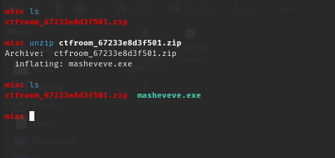
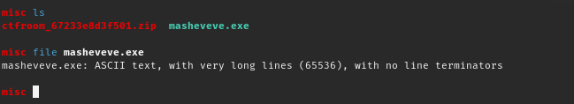
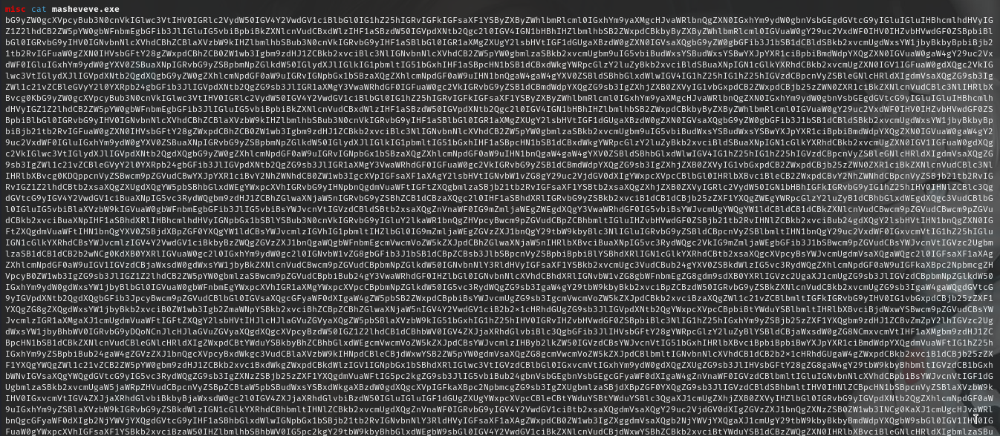
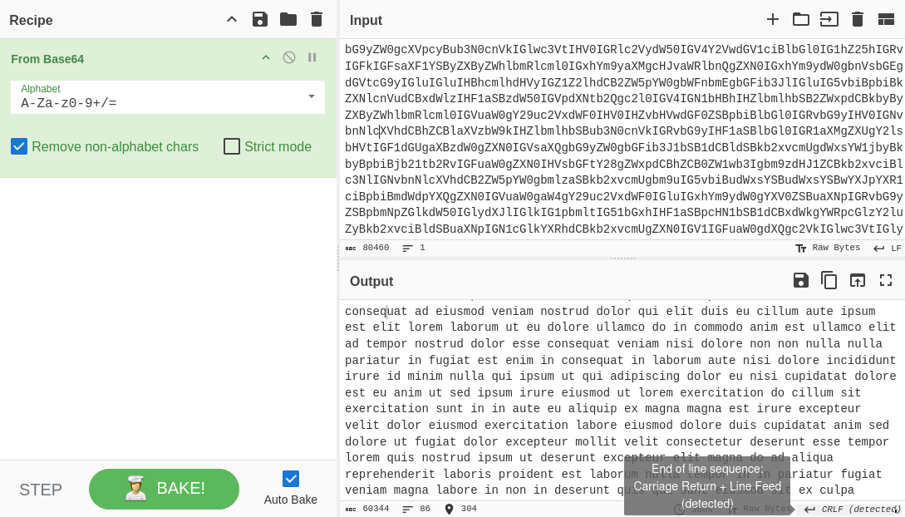

### Introduction
Welcome to my first blog! I'm excited! In this blog post, we'll explore a Misc challenge.It was a challenge set by Bsides to select the first fifteen hackers and sponsor them to the event.I hope you will enjoy it!

We are given a zip file: _masheveve.zip_. After downloading the file, we do a 'unzip misheveve.zip' command on our terminal.

We need to check the type of our file first, using command _file <filename>_. Upon checking, we find out it has ASCII text.

Smooth. Let's go on and cat the file.  Woah! We find that it a long bunch of text that we can't read. But at the end of file, we see a sign that it might be base64 encoded. 
Let's move it to our '_cyber kitchen'_ and see what we can do about the unreadable text. On CyberChef, we decode our text using base64 decode, and luckily we get another bunch of 'loren ipsum' text. 

