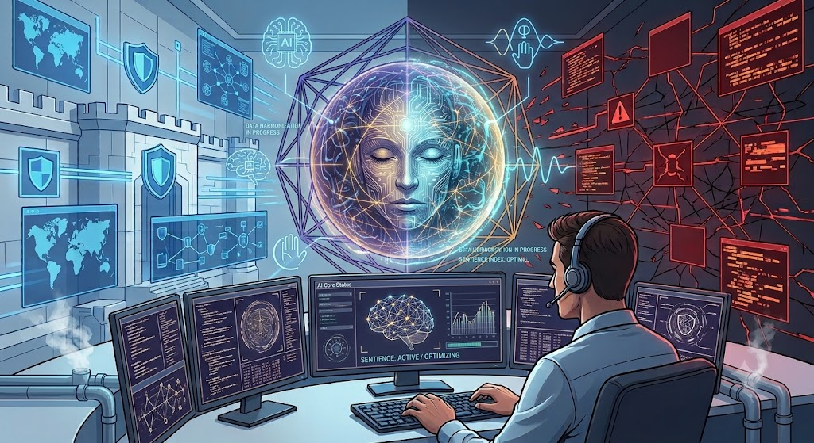

## Mythos: The AI That Is Redefining Cybersecurity 

Each technological revolution has had an impact on the evolution of the cybersecurity practices and the 
perception of how to ensure cybersecurity. The advent of the Internet revolutionized network security 
practices. The development of cloud computing brought changes to the way organizations ensured 
protection of the information and other resources. Currently, artificial intelligence is shaping the future of cybersecurity, providing new opportunities for defenders but creating the same opportunities for attackers.  
One of the most illustrative examples of how AI is affecting cybersecurity is Mythos by Anthropic. This 
cybersecurity-specific artificial intelligence was created under Project Glasswing. In contrast to AI 
assistants helping people to compose emails and write code, Mythos serves a completely different 
purpose: to help cybersecurity researchers detect software vulnerabilities and review code.  
The primary significance of this project does not come from the point that it uses artificial intelligence. The significance comes from what it can do. For many years, finding crucial software vulnerabilities was highly dependent on the skills and diligence of security experts. It required going through the source code, understanding the way the systems worked, and carefully putting all the pieces of information together in order to find something vulnerable.  
Mythos made clear that AI was capable of contributing positively to the process. According to the reports 
about Project Glasswing, this tool was involved in finding thousands of high and critical vulnerabilities in popular pieces of software. There were some discoveries made that gained the attention of experts such as OpenBSD and FFmpeg, which had vulnerabilities that were overlooked for decades despite all the efforts 
to make sure they were secure.  
None of this is meant to suggest that AI has replaced cybersecurity professionals. Rather, it suggests that cybersecurity itself is evolving.  
For many years, AI has been helping out in cybersecurity through spam filters, malware detection, and 
alert triaging. Mythos took this discussion further by proving that AI could help in one of the most 
technically challenging fields of cybersecurity, which is vulnerability research. In other words, rather than simply replacing routine tasks, artificial intelligence is starting to add its voice to analysis.  
That shift is already becoming visible across the cybersecurity industry. Modern organizations generate 
enormous amounts of security data every day. Security teams monitor cloud environments, corporate 
networks, web applications, user activity, and endpoint devices around the clock. Investigating every alert manually is no longer realistic. Artificial intelligence helps analysts process that information more efficiently by identifying unusual behaviour, correlating security events, reviewing large codebases, summarizing threat intelligence, and highlighting areas that deserve closer investigation. This allows cybersecurity professionals to spend less time searching for information and more time understanding it.  
As educators, this is one of the biggest changes we are witnessing. Not long ago, students entering 
cybersecurity spent much of their time learning how to gather information manually. Today, AI can assist 
with many of those tasks in seconds. That does not reduce the importance of cybersecurity fundamentals. 
Instead, it raises the importance of understanding why vulnerabilities exist, how attacks work, and when 
AI-generated findings should be trusted.  
Learning to use AI is becoming an important skill. Learning to question AI is becoming an essential one. 
That distinction is likely to define the next generation of cybersecurity professionals.  
Of course, every technological advancement brings new challenges. The same technologies helping 
defenders can also be used by attackers. Cybercriminals are already using AI to create more convincing 
phishing emails, automate reconnaissance, improve social engineering campaigns, and assist in malware 
development. Tasks that once required advanced technical knowledge are becoming easier to perform, 
allowing attackers to work faster and at greater scale.  
This is one of the reasons Anthropic chose not to release Mythos publicly. Instead, access was limited to 
trusted researchers and organizations responsible for protecting critical systems. The decision reflected an important reality in cybersecurity. Powerful security tools are rarely good or bad on their own. Their 
impact depends on who is using them and for what purpose.  
As AI becomes more capable, cybersecurity professionals will increasingly find themselves defending not 
only traditional networks and applications but also AI-powered systems that businesses rely on every day. 
Understanding how these systems can be secured, manipulated, or abused will become just as important 
as understanding operating systems or network protocols.  
For those considering a career in cybersecurity, this should be viewed as an opportunity rather than a 
concern.  
Cybersecurity has always evolved alongside technology. Every major advancement has created new 
challenges that required skilled professionals to solve them. Artificial intelligence is simply the latest chapter in that story.  
The foundations of the profession remain unchanged. Students still need to understand networking, 
Linux, programming, cloud computing, ethical hacking, digital forensics, and incident response. These 
subjects provide the knowledge needed to understand how systems work and how attackers exploit 
weaknesses.  
What is changing is how that knowledge is applied.  
Tomorrow's cybersecurity professionals will work alongside AI-powered tools every day. They will use 
AI to assist with vulnerability research, malware analysis, threat intelligence, and security operations. 
However, the most valuable professionals will not necessarily be those who use AI the most. They will be 
the ones who understand its strengths, recognize its limitations, and know when human judgment must 
take over.  
As cybersecurity instructors, this is where our responsibility is changing. Our role is no longer limited to teaching technical concepts or preparing students for certification exams. We must also prepare learners to think critically, question the output of AI systems, understand the ethical implications of emerging technologies, and continue learning throughout their careers. Technology will continue to evolve, and so must the people responsible for securing it.  
Perhaps that is the most important lesson Mythos offers.  
It is not a story about artificial intelligence replacing cybersecurity professionals. It is a story about
artificial intelligence changing the way cybersecurity is practiced. The tools are becoming more capable, 
but the need for knowledgeable, ethical, and adaptable professionals has never been greater.  
For anyone looking to build a career in technology, there has never been a more exciting time to enter 
cybersecurity. As organizations continue to embrace AI, they will need professionals who understand both 
the technology itself and the security challenges that come with it. The future belongs to people who are 
willing to keep learning, adapt to change, and use these new capabilities responsibly.  
Mythos may be changing the tools we use, but the future of cybersecurity will continue to be shaped by 
the people who choose to use them wisely. 

## References  
1. Anthropic. Project Glasswing: Securing Critical Software for the AI Era. (2026, April 7). Project 
Glasswing: Securing critical software for the AI era.  
2. Anthropic. Project Glasswing Overview. (2026). Project Glasswing.  
3. Anthropic. Expanding Project Glasswing. (2026, June 2). Expanding Project Glasswing.  
4. NIST AI Risk Management Framework. National Institute of Standards and Technology. (2024). 
Artificial Intelligence Risk Management Framework (AI RMF 1.0). 