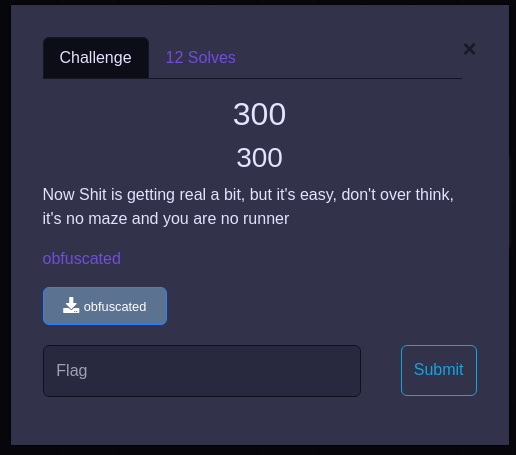
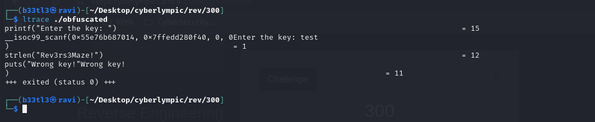

### Challenge Overview
 
"Now Shit is getting real a bit, but it's easy, don't over think, it's no maze and you are no runner"  
We are given a 64-bit PIE ELF binary that prompts for a key and verifies it. From the description, we are told not to overthink it cause it is easy.  
Our goal is to find the correct input key to get the flag.

### Initial Recon
Using 'file' and 'checksec', we get:  
  
We see that the binary is a PIE executable with no canary, NX enabled, and partially RELRO.

Running the binary prompts for a key, and a random key yields 'Wrong key!:  

### Analysis
#### String Extraction
Running 'strings obfuscated' revealed some interesting strings:  
    - Rev3rs3MH  
    - s3Maze!  
    - acdfCTF{ObfuscatedSuccess} (likely the flag)  
    - Wrong key!  
    - Correct! Flag: %s  

#### Tracing library cells (ltrace)
Running 'ltrace ./obfuscated' and entering some random input shows:  

The program calls 'strlen("Rev3rs3Maze!")' internally. This is a strong hint that "Rev3rs3Maze!" is the key or closely related.

#### Key hypothesis
The program checks for the input key to match "Rev3rs3Maze!".  
This string is a combination of or close variant of the strings seen in 'strings' output.

### Solution
Let's enter the key: Rev3rs3Maze!  
 
Entering the key gives us the flag.  
Flag: _acdfCTF{ObfuscatedSuccess}_
