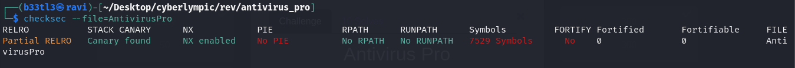
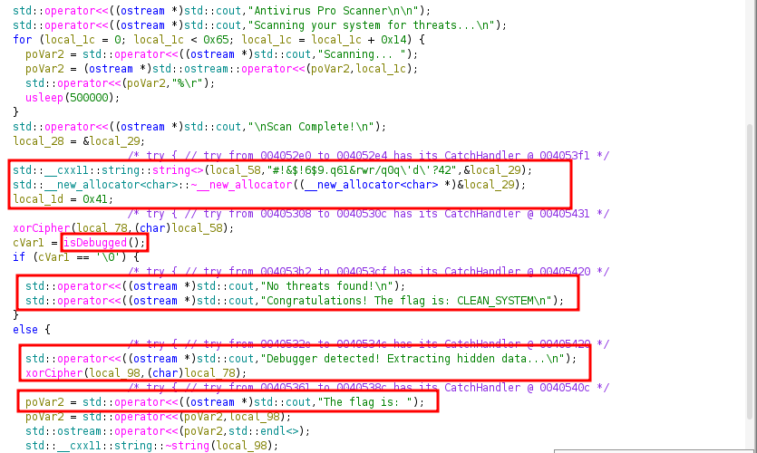
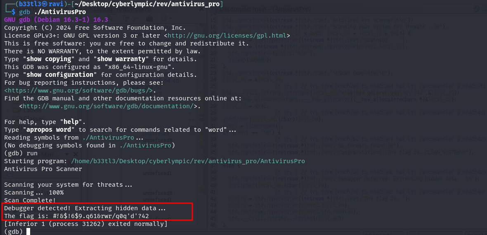
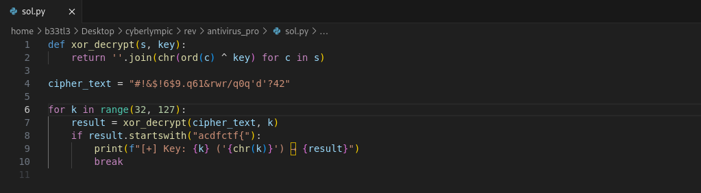

### Introduction
In this reverse engineering challenge, we're given an executable called AntivirusPro and told:  
“The antivirus says your system is clean... but are you sure?”  

This sounds like a classic misdirection challenge — where the program pretends to be doing something straightforward, but hides its real behavior. The challenge tests our ability to reverse engineer binary logic, understand obfuscation, and recover hidden data.

### Initial Recon
We start by examining the binary properties using standard Linux tools.  
_File_ output: 
  - It's 64-bit Linux ELF binary.
  - Statically linked: means no dynamic dependencies.
  - Not stripped: function names are preserved.

_Checksec_ output: 

_Running the binary_:

We get a fake-looking flag: _CLEAN_SYSTEM_. This is clearly not the real flag (no acdfctf{} format).

### Static Analysis in Ghidra
Since the binary is not stripped, I imported it into Ghidra and inspected various functions.  
_Observations in main function_
Looking at the _main_ function, we see:
  - Strings and fake scanning output.
  - A suscipious call to a function called _isDebugged()_.
  - If _isDebugged()_ returns true, it runs a second code path. It shows "Debugger detected! Extracting hidden data..." Then it decrypts and prints a hidden string using _xorCipher_. 
  
  - "xorCipher(local_98, local_78);" This is the key decryption step. _local_78_ contains the intermediate XOR-encoded data, obtained by applying 'xorCipher()' once on the obfuscated string earlier. Now, 'xorCipher()' is being applied again on that result (local_78) to produce the final flag in _local_98_.
  - That means if we debug the the binary, it will show the real flag, encypted - we just have to extract and decrypt it.

### Dynamic Analysis
I ran the binary in _gdb_: 
We see the encrypted flag: _#!&$!6$9.q61&rwr/q0q'd'?42_

### Reversing xorCipher
From Ghidra: _std::__cxx11::string::operator+=(param_1, *iterator ^ key);_
This confirms a single-byte XOR cipher.  
We know that the string was encrpyted twice:
- The original flag --> XORed --> intermediate result.
- Intermediate --> XORed again --> the obfuscated string we see: #!&$!6$9.q61&rwr/q0q'd'?42
All we need now is to bruteforce-decrypt this with all possible XOR keys.

### XOR Decryption
I came up with the following python script to solve this:

Output:

We get the flag: _acdfctf{l3tsd050m3r3e&e}_
