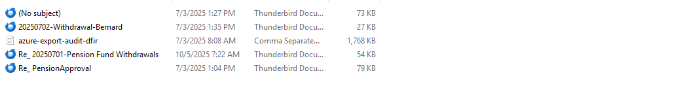
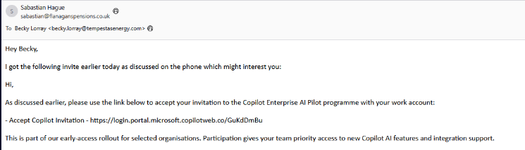
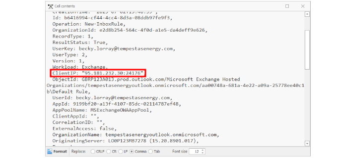

## Scenario
We're in trouble, our organisation is facing a potential high-impact financial cyber incident centred around our company pension fund. Over the past 48 hours, a significant number of authorised bank transfers were processed, moving large sums from the pension account to multiple external bank accounts, both domestic and international. We don't even know where to start, but lets kick off with this information - our CFO can approve these transactions, so we've provided you with an export of Azure Audit logs in addition to some emails we think might be relevant.

## Introduction
The challenge, titled BEC-KY on Blue Team Labs Online (BTLO), simulates a Business Email Compromise (BEC), one of the most financially damaging cyber threats to organisations today.  

BEC attacks rely less on malware and more on social engineering and account compromise, exploiting trust within an organisation to manipulate legitimate financial processes.  
In this case, I needed to analyse:  
 - Phishing emails that may have initiated the attack.
 - Audit logs from Azure to trace suspicious account activity.
 - Evidence of mailbox rules or inbox manipulation to hide traces.

There are several artefacts in the lab; some .eml files and a csv file.  
  

## Investigation Submission
### What is the source address of the initial phishing email?
By reviewing the .eml files, one particular message stood out - it contained signs of phishing, such as urgency and financial context.  
The sender address was: sabastian@flanaganspensions.co.uk  
  

This indicated that the attacker likely impersonated or compromised this account to reach internal staff.  

Answer: _sabastian@flanaganspensions.co.uk_

### What type of compromise is this?
Given that financial transactions were authorised using legitimate credentials, and no malware was mentioned - this was clearly a Business Email Compromise (BEC) scenario. Also from the scenario description, it all points to BEC.  

In such attacks, adversaries typically gain access to an executive’s email (often via phishing), then manipulate ongoing financial conversations to redirect funds.  
Answer: _Business Email Compromise_

### What are the two IPs utilised by the TA?
To uncover the attacker’s operational infrastructure, I turned to the Azure audit logs (CSV).  

Using TimelineExplorer, I searched for relevant IP fields and filtered entries associated with the compromised accounts:  
  
By focusing on logs linked to the CFO “becky,” I found: 159.203.17.81  

The second IP took me a lot of time to discover. Then I associated the threat actor as sabastian which narrowed down my search. The I got the IP: 95.181.232.30  
  
These two IPs correspond to the attacker’s login locations during the compromise.  

Answer: _159.203.17.81, 95.181.232.30_

### Which bank is the transaction sent to?
One of the emails referenced a SWIFT code, which I looked up using an online SWIFT database.  
  
The lookup pointed to: FIRST BANK OF NIGERIA LTD  
  
This revealed where the fraudulent pension fund transfers were directed.  

Answer: _FIRST BANK OF NIGERIA LTD_

### What is the name of the Inbox folder created during the compromise?
Attackers often create hidden folders to store or move messages related to their operations.  
Narrowing the search down to sabastian, I looked at the logs and found a ‘MoveToFolder’ value.  
  

Answer: _History_

### What word is the first inbox rule created looking for, within the subject or body, prior to deleting the email 
The attacker also created an inbox rule to delete or divert emails containing specific keywords. This is a common BEC tactic to avoid detection.  
By searching for “NewInboxRule” in the logs, I found that the rule targeted emails containing the word: Withdrawal.  
  
This helped the attacker conceal any messages mentioning fund movements.  

Answer: _Withdrawal_

## Lessons Learned
This challenge highlights how attackers exploit human trust and weak email security configurations to conduct large-scale financial fraud.  
Some critical takeaways include:  
 - Email is still the most exploited vector in corporate environments.
 - Monitoring for suspicious inbox rule creation can help detect BEC attempts early.
 - Geo-anomalies in login IPs (foreign logins or unknown regions) should trigger alerts.
 - User awareness and phishing training remain vital in protecting financial staff.

## Conclusion
The BEC-KY challenge was an insightful deep dive into the mechanics of Business Email Compromise. It demonstrated that even without malware, adversaries can cause catastrophic financial losses by abusing trust and legitimate credentials.  

Defending against BEC requires a layered approach - from strong MFA and conditional access policies to vigilant user education and continuous log monitoring.  

This case reinforces a core truth in cybersecurity: technology may protect, but awareness prevents.