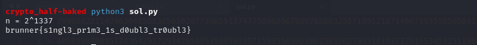
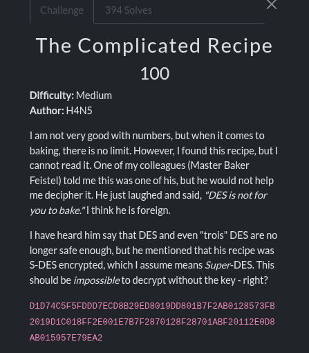
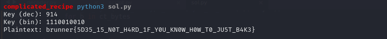
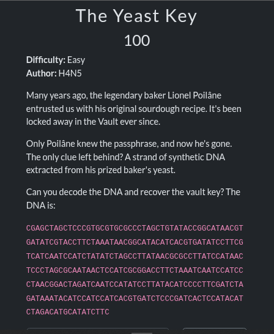
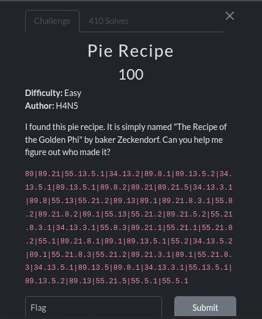
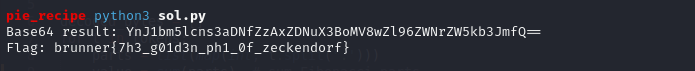
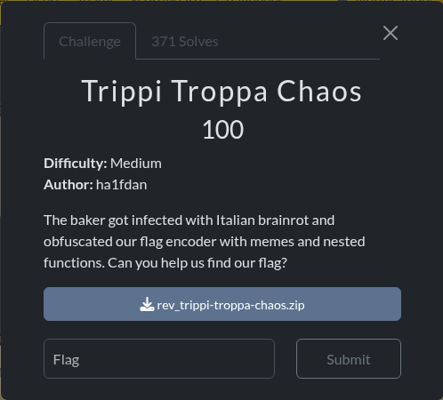
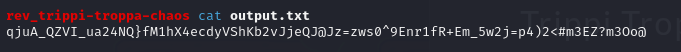

# Introduction
CTFs have a special way of turning problem-solving into an adventure - part puzzle hunt, part crash course, and part adrenaline rush. The BrunnerCTF was no exception: a collection of challenges that pushed me to think differently, test my skills, and learn on the fly. <br>

From crypto riddles and reverse engineering twists to forensics clues and pwn trickery, every challenge felt like unlocking a small mystery. Some solutions came quickly, others forced me to slow down and dig deeper - but that’s exactly the kind of mix that makes CTFs both fun and rewarding.

In this writeup, I’ll walk through the challenges I tackled, breaking down how I approached them, where I stumbled, and what finally clicked. Whether you’re new to CTFs or just curious about the thought process behind them, I hope this gives you both a clear path through the problems and a few insights you can use in your own journey. <br>


## Cryptography
### Half-Baked
Here is the challenge description: <br>
 <br>

Attached to the description was a zip file. On unzipping it, I got a .txt file: half-baked.txt <br>
The text file contained values; <br>
n - RSA modulus <br>
e - public exponent <br>
c - ciphertext <br>
```
crypto_half-baked cat half-baked.txt 
n = 2999882211429630485883650302877390551374775896896788078868325571891218714007953558505041388044334470201821965796391409921668122818083570668568660678895962925314655342154580738160357641047430373917156721861167458749434940591017306495880180805391185380307427539761080193213111534709378234670214284858143824384128077373871882033779166821558334466322908873171079631967672353755842618738501413251304204009472
e = 65537
c = 406899880095774364291729342954053590589397159355690238625035627993181937179155345315119680672959072539867481892078815991872758149967716015787715641627573675995588117336214614607141418649060621601912927211427125930492034626696064268888134600578061035823593102305974307471288655933533166631878786592162718700742194241218161182091193661813824775250046054642533470046107935752737753871183553636510066553725
```

#### Understanding RSA
Here is how RSA works: <br>
 - Choose two large primes: p and q
 - Compute; n = p * q
 - Compute Euler’s totient φ(n) = (p-1)(q-1)
 - Pick e (commonly 65537)
 - Compute private key d = e⁻¹ mod φ(n)
 - Encryption: c = m^e mod n
 - Decryption: m = c^d mod n

But here, the challenge description says the boss wanted “2 primes” but then specifically chose the number 2 (not two primes). Uh oh… <br>

Inspecting n, it turns out to be an even number. Dividing repeatedly by 2: n = 2^1337 <br>
So instead of a secure RSA modulus, the “boss” just picked a single prime base (2), raised to a power. That’s why the system is “half-baked.” <br>
I came up with a script to solve this challenge: <br>
```python
n = 2999882211429630485883650302877390551374775896896788078868325571891218714007953558505041388044334470201821965796391409921668122818083570668568660678895962925314655342154580738160357641047430373917156721861167458749434940591017306495880180805391185380307427539761080193213111534709378234670214284858143824384128077373871882033779166821558334466322908873171079631967672353755842618738501413251304204009472
e = 65537
c = 406899880095774364291729342954053590589397159355690238625035627993181937179155345315119680672959072539867481892078815991872758149967716015787715641627573675995588117336214614607141418649060621601912927211427125930492034626696064268888134600578061035823593102305974307471288655933533166631878786592162718700742194241218161182091193661813824775250046054642533470046107935752737753871183553636510066553725

# Factor n = 2^k
k = 0
t = n
while t % 2 == 0:
    t //= 2
    k += 1

print(f"n = 2^{k}")

# Carmichael function λ(2^k) = 2^(k-2)
lam = 1 << (k - 2)

# Extended Euclidean Algorithm to find modular inverse
def inv_mod(a, m):
    t, newt = 0, 1
    r, newr = m, a % m
    while newr != 0:
        q = r // newr
        t, newt = newt, t - q * newt
        r, newr = newr, r - q * newr
    if r != 1:
        raise ValueError("no inverse")
    return t % m

d = inv_mod(e, lam)

# Decrypt
mod = 1 << k
m = pow(c, d, mod)

# Convert to bytes
m_bytes = m.to_bytes((m.bit_length() + 7) // 8, 'big')
print(m_bytes.decode())
```
Running the script, I got the flag:
 <br>

Final flag: <br>
```
brunner{s1ngl3_pr1m3_1s_d0ubl3_tr0ubl3}
```

### The Complicated Recipe
Challenge description: <br>
 <br>

TL;DR <br>
 - The flavor text (“Master Baker Feistel”, “DES”, “trois DES”) hints at a Feistel network and a DES-like toy cipher.
 - “S-DES” here is Simplified DES (the small teaching cipher), not DES/3DES.
 - S-DES uses 8-bit blocks and a 10-bit key → only 1024 keys → brute force the key.
 - Implement S-DES, try all keys, and keep the plaintext that decodes to readable ASCII.
- Flag: brunner{5D35_15_N0T_H4RD_1F_Y0U_KN0W_H0W_T0_JU5T_B4K3}

The challenge provides a hex string: <br>
```
D1D74C5F5FDDD7ECD8B29ED8019DD801B7F2AB0128573FB2019D1C018FF2E001E7B7F2870128F28701ABF20112E0D8AB015957E79EA2
```
It has length of 108 characters, that's 54 bytes. This fits perfectly for S-DES (which encrypts 1 byte per block). <br>
From the hints in the challenge's description: 'Master Baker Feistel', 'S-DES', this is the tiny S-DES cipher. <br>
S-DES is a miniature version of DES designed for teaching: <br>
 - Block size: 8 bits (1 byte).
 - Key size: 10 bits (values 0–1023).

#### Strategy
 - Parse the hex into bytes (54 bytes).
 - Implement S-DES decrypt (or encrypt+reverse subkeys) for a single byte.
 - Brute force all 1024 keys:
    - Decrypt all 54 bytes with each key.
    - Score the result (e.g., printable ASCII ratio, presence of { / } / flag / CTF).
 - Keep the most printable candidate; it should be clearly readable.

Why this works: The space of 1024 keys is tiny; one key will produce a fully readable string while others will be gibberish. <br>

I implemented standard S-DES (permutation tables, S-boxes, key schedule) and tried all keys 0…1023; for each decryption I checked how printable the output was, and whether it had flag-like markers. <br>
Script that I used: <br>
```python
#!/usr/bin/env python3
from typing import List

CIPHER_HEX = (
    "D1D74C5F5FDDD7ECD8B29ED8019DD801B7F2AB0128573FB2019D1C018FF2E001"
    "E7B7F2870128F28701ABF20112E0D8AB015957E79EA2"
)

def bits_from_int(x: int, n: int) -> List[int]:
    return [(x >> (n - 1 - i)) & 1 for i in range(n)]

def int_from_bits(bits: List[int]) -> int:
    v = 0
    for b in bits:
        v = (v << 1) | (b & 1)
    return v

def permute(bits: List[int], table: List[int]) -> List[int]:
    return [bits[i - 1] for i in table]

P10 = [3, 5, 2, 7, 4, 10, 1, 9, 8, 6]
P8  = [6, 3, 7, 4, 8, 5, 10, 9]
IP  = [2, 6, 3, 1, 4, 8, 5, 7]
IP_INV = [4, 1, 3, 5, 7, 2, 8, 6]
EP  = [4, 1, 2, 3, 2, 3, 4, 1]
P4  = [2, 4, 3, 1]

S0 = [
    [1, 0, 3, 2],
    [3, 2, 1, 0],
    [0, 2, 1, 3],
    [3, 1, 3, 2],
]
S1 = [
    [0, 1, 2, 3],
    [2, 0, 1, 3],
    [3, 0, 1, 0],
    [2, 1, 0, 3],
]

def left_shift(bits: List[int], n: int) -> List[int]:
    return bits[n:] + bits[:n]

def generate_subkeys(key10: List[int]):
    p10 = permute(key10, P10)
    left = p10[:5]; right = p10[5:]
    left1 = left_shift(left, 1)
    right1 = left_shift(right, 1)
    k1 = permute(left1 + right1, P8)
    left2 = left_shift(left1, 2)
    right2 = left_shift(right1, 2)
    k2 = permute(left2 + right2, P8)
    return k1, k2

def sbox_lookup(sbox, bits4: List[int]) -> List[int]:
    row = (bits4[0] << 1) | bits4[3]
    col = (bits4[1] << 1) | bits4[2]
    val = sbox[row][col]
    return [(val >> 1) & 1, val & 1]

def fk(bits8: List[int], subkey: List[int]) -> List[int]:
    left = bits8[:4]; right = bits8[4:]
    ep_out = permute(right, EP)
    xor_with_key = [a ^ b for a, b in zip(ep_out, subkey)]
    s0_bits = sbox_lookup(S0, xor_with_key[:4])
    s1_bits = sbox_lookup(S1, xor_with_key[4:])
    p4_out = permute(s0_bits + s1_bits, P4)
    left_result = [a ^ b for a, b in zip(left, p4_out)]
    return left_result + right

def sdes_decrypt_block(block8: List[int], key10: List[int]) -> List[int]:
    k1, k2 = generate_subkeys(key10)
    ip = permute(block8, IP)
    after_fk1 = fk(ip, k2)                 # reverse order!
    switched = after_fk1[4:] + after_fk1[:4]
    after_fk2 = fk(switched, k1)
    plain = permute(after_fk2, IP_INV)
    return plain

def byte_to_bits(b: int) -> List[int]:
    return bits_from_int(b, 8)

def bits_to_byte(bits: List[int]) -> int:
    return int_from_bits(bits) & 0xFF

def decrypt_bytes_with_key(ct_bytes: bytes, key_int: int) -> bytes:
    key10 = bits_from_int(key_int, 10)
    return bytes(
        bits_to_byte(sdes_decrypt_block(byte_to_bits(b), key10))
        for b in ct_bytes
    )

def printable_ratio(bs: bytes) -> float:
    if not bs: return 0.0
    return sum(1 for c in bs if 32 <= c < 127) / len(bs)

def main():
    ct = bytes.fromhex(CIPHER_HEX)
    best = None
    for key in range(1024):
        pt = decrypt_bytes_with_key(ct, key)
        score = printable_ratio(pt)
        try:
            s = pt.decode("ascii")
        except:
            s = None
        if s and ("{" in s or "flag" in s.lower() or "CTF" in s.upper() or score > 0.95):
            best = (key, score, s)
            break

    if best:
        key, score, s = best
        print(f"Key (dec): {key}")
        print(f"Key (bin): {bin(key)[2:].zfill(10)}")
        print(f"Plaintext: {s}")
    else:
        print("No plausible plaintext found.")

if __name__ == "__main__":
    main()
```

Running this gave me the flag: <br>
 <br>

Final flag: <br>
```
brunner{5D35_15_N0T_H4RD_1F_Y0U_KN0W_H0W_T0_JU5T_B4K3}
```


## Misc
### The Yeast Key
The challenge description: <br>
 <br>

#### Brainstorming
The challenge begins with a mysterious DNA sequence, supposedly extracted from Lionel Poilâne’s legendary sourdough yeast. <br>
The description emphasizes that this strand of DNA is the only clue to recovering the vault key, which immediately suggests that the string of nucleotides is hiding some form of encoded data. <br>
I read somewhere that when you see DNA sequences, it is usually a hint that the data is encoded in bases (A, C, G, T) rather than standard binary/hex. <br>
The string given: <br>
```
CGAGCTAGCTCCCGTGCGTGCGCCCTAGCTGTATACCGGCATAACGTGATATCGTACCTTCTAAATAACGGCATACATCACGTGATATCCTTCGTCATCAATCCATCTATATCTAGCCTTATAACGCGCCTTATCCATAACTCCCTAGCGCAATAACTCCATCGCGGACCTTCTAAATCAATCCATCCCTAACGGACTAGATCAATCCATATCCTTATACATCCCCTTCGATCTAGATAAATACATCCATCCATCACGTGATCTCCCGATCACTCCATACATCTAGACATGCATATCTTC
```
A DNA strand has four possible symbols: A, C, G, T. <br>
Four symbols = 2 bits of information each (00, 01, 10, 11). <br>

A straightforward mapping is to assign bits in alphabetical order: <br>
 - A = 00
 - C = 01
 - G = 10
 - T = 11.
With this system, every four DNA bases become one byte, because each base contributes 2 bits and 2 × 4 = 8 bits makes up a full ASCII character. This gives us a way to gradually turn the DNA sequence into readable text. <br>

#### Decoding
Script used: <br>
```python
dna = "CGAGCTAGCTCCCGTGCGTGCGCCCTAGCTGTATACCGGCATAACGTGATATCGTACCTTCTAAATAACGGCATACATCACGTGATATCCTTCGTCATCAATCCATCTATATCTAGCCTTATAACGCGCCTTATCCATAACTCCCTAGCGCAATAACTCCATCGCGGACCTTCTAAATCAATCCATCCCTAACGGACTAGATCAATCCATATCCTTATACATCCCCTTCGATCTAGATAAATACATCCATCCATCACGTGATCTCCCGATCACTCCATACATCTAGACATGCATATCTTC"

mapping = {'A':'00','C':'01','G':'10','T':'11'}
bits = ''.join(mapping[b] for b in dna)
bytes_ = [bits[i:i+8] for i in range(0, len(bits), 8)]
decoded = ''.join(chr(int(b, 2)) for b in bytes_)
print(decoded)
```
Running this script, I got the flag: <br>
 <br>

Final flag: <br>
```
brunner{1i0n3l_p0i14n3_m4573r_0f_50urd0u6h_p455phr453_15_cr01554n7V4u17!93}
```

### Pie Recipe
Challenge description: <br>
 <br>

#### Brainstorming
The challenge’s description mentions things like ‘recipe of the Golden Phi’, and Zeckendorf. <br>
What are these names? <br>
Phi (φ) - is a golden ratio. Relates to fibonacci. atios of consecutive Fibonacci numbers (like 21/13, 34/21, 55/34, …) approach φ as they get larger. <br>
This is why φ and Fibonacci are often paired together. <br>
Zeckendorf - a theorem that every positive integer can be written uniquely as the sum of non-consecutive fibonacci numbers - unique way to represent integers as sums of Fibonacci numbers. <br>

This challenge mentions phi and Zeckendorf to hint at Fibonacci. <br>
Together, the hints suggest the numbers in the recipe are Fibonacci numbers, and when we add them, they give ASCII codes. <br>
Each token in the puzzle (like 55.13.5.1) is just a Zeckendorf representation of an ASCII code: <br>
55 + 13 + 5 + 1 = 74 → ASCII ‘J’. <br>
Decoding all the token gives a base64 string. <br>

#### Decoding
Solution script: <br>
```py
import base64

s = "89|89.21|55.13.5.1|34.13.2|89.8.1|89.13.5.2|34.13.5.1|89.13.5.1|89.8.2|89.21|89.21.5|34.13.3.1|89.8|55.13|55.21.2|89.13|89.1|89.21.8.3.1|55.8.2|89.21.8.2|89.1|55.13|55.21.2|89.21.5.2|55.21.8.3.1|34.13.3.1|55.8.3|89.21.1|55.21.1|55.21.8.2|55.1|89.21.8.1|89.1|89.13.5.1|55.2|34.13.5.2|89.1|55.21.8.3|55.21.2|89.21.3.1|89.1|55.21.8.3|34.13.5.1|89.13.5|89.8.1|34.13.3.1|55.13.5.1|89.13.5.2|89.13|55.21.5|55.5.1|55.5.1"
tokens = s.split('|')

decoded_bytes = []
for t in tokens:
    parts = list(map(int, t.split('.')))
    value = sum(parts)  # sum Fibonacci parts
    decoded_bytes.append(value)

b64 = ''.join(chr(v) for v in decoded_bytes)
print("Base64 result:", b64)

flag = base64.b64decode(b64).decode()
print("Flag:", flag)
```
Running the script gave me the flag: <br>
 <br>
Final flag: <br>
```
brunner{7h3_g01d3n_ph1_0f_zeckendorf}
```


## Reverse Engineering
### Trippi Troppa Chaos
This was an interesting challenge, following the Italian brainrot haha. <br>
Challenge description: <br>
 <br>

A zip file, unzipping it I got two files, output.txt and trippa_troppa_sus.py <br>
output.txt: <br>
 <br>

trippi_troppa_sus.py: <br>
```python
#!/usr/bin/env python3
import sys as _tralalero_tralala_impostor_____
(lambda _bombardiro_crocodilo___: [
    setattr(__builtins__, '__boneca_ambalabu_toilet____', __import__('base64').b85encode),
    setattr(__builtins__, '___trippa_troppa_mewing___', __import__('hashlib').sha256),
    setattr(__builtins__, '__tung_tung_sahur_cycle_____', __import__('itertools').cycle),
    setattr(__builtins__, '____pinguino_arrabiato_seed____', __import__('random').seed)
][_bombardiro_crocodilo___] and None)(0) or ____pinguino_arrabiato_seed____(69420)

def ___ranocchio_turbina_function_factory____():
    def ____lirilì_rilà_final_boss_____():
        def _____trippi_troppa_skibidi_____():
            def ______crocodina_gigachad_nested______():
                def _______tralala_alpha_transformation_______():
                    def ________boneca_beta_elimination________():
                        def _________sahur_sigma_activities_________():
                            def __________bombardiro_mewing__________():
                                def ___________trippa_no_cap___________():
                                    def ____________tung_bussin_respectfully____________():
                                        def _____________tralalero_slay_queen_energy_____________():
                                            __fanum_tax_pinguino____ = lambda ___cringe_normie_bombardiro___, ____based_chad_crocodilo____: (lambda ____uwu_owo_tralalero____: [__c__ for __c__ in ____uwu_owo_tralalero____])(
                                                [___x___ ^ ___y___ for ___x___, ___y___ in zip(___cringe_normie_bombardiro___, __tung_tung_sahur_cycle_____(____based_chad_crocodilo____))]
                                            )
                                            
                                            def ____boneca_ambalabu_university____(___x_trippa___, ___y_troppa___):
                                                return (lambda ____bruh_moment_lirilì____: ____bruh_moment_lirilì____.digest()[:len(___y_troppa___)])(
                                                    ___trippa_troppa_mewing___(
                                                        ((___x_trippa___.decode() if isinstance(___x_trippa___, bytes) else ___x_trippa___) + 
                                                         (___y_troppa___.decode() if isinstance(___y_troppa___, bytes) else ___y_troppa___)).encode()
                                                    )
                                                )
                                            
                                            def ____tralalero_griddy_dance____(___x_ranocchio___):
                                                return (lambda ____fortnite_bombardiro_pass____: 
                                                       [___c_crocodina___ for ___c_crocodina___ in ____fortnite_bombardiro_pass____]
                                                )([((___c_sahur___ * 7) % 256) for ___c_sahur___ in ___x_ranocchio___])
                                            
                                            def ____tung_reverse_uno_card____(___x_pinguino___):
                                                return (lambda ____amogus_sus_trippi____: ____amogus_sus_trippi____[::-1])(___x_pinguino___)
                                            
                                            def ____dead_meme_boneca_graveyard____():
                                                ____poggers_tralala____, ____chungus_rilà____, ____keanu_troppa____ = 1337, 420, 9000
                                                for ___i_bombardiro___ in (lambda ___x_crocodilo___: range(___x_crocodilo___))(5):
                                                    ____poggers_tralala____ = (____poggers_tralala____ * ____chungus_rilà____ + ____keanu_troppa____) % (___i_bombardiro___ + 7)
                                                return ____poggers_tralala____
                                            
                                            def ____touch_grass_tralalero_function____():
                                                try:
                                                    with open("flag.txt", "rb") as ____yeet_file_ambalabu____:
                                                        ____cringe_flag_pinguino____ = ____yeet_file_ambalabu____.read()
                                                except:
                                                    return "L + ratio + skill issue + no tralalero for you"
                                                
                                                ____sussy_key_bombardiro____ = b"skibidi"
                                                
                                                ____step_one_boneca____ = ____boneca_ambalabu_university____(____sussy_key_bombardiro____, ____sussy_key_bombardiro____)
                                                ____step_two_sahur____ = bytes(__fanum_tax_pinguino____(____cringe_flag_pinguino____, ____step_one_boneca____))
                                                ____step_three_trippa____ = bytes(____tralalero_griddy_dance____(____step_two_sahur____))
                                                ____step_four_troppa____ = ____tung_reverse_uno_card____(____step_three_trippa____)
                                                ____final_boss_crocodina____ = __boneca_ambalabu_toilet____(____step_four_troppa____).decode()
                                                
                                                return ____final_boss_crocodina____
                                            
                                            return ____touch_grass_tralalero_function____
                                        return _____________tralalero_slay_queen_energy_____________
                                    return ____________tung_bussin_respectfully____________
                                return ___________trippa_no_cap___________
                            return __________bombardiro_mewing__________
                        return _________sahur_sigma_activities_________
                    return ________boneca_beta_elimination________
                return _______tralala_alpha_transformation_______
            return ______crocodina_gigachad_nested______
        return _____trippi_troppa_skibidi_____
    return ____lirilì_rilà_final_boss_____

if __name__ == "__main__":
    print((lambda ___x_tralalero___: ___x_tralalero___()()()()()()()()()()()())(___ranocchio_turbina_function_factory____))
```

This screams “the baker got Italian brainrot and wrapped the flag in 50 layers of pasta.” <br>

Buried inside all the skibidi rizz sigma function calls is the real encoding pipeline: <br>
```
key = sha256("skibidiskibidi").digest()[:7]
```
 - Take SHA-256 of "skibidiskibidi", truncate to 7 bytes.
 - XOR the flag with that key (cycled over flag length).
 - Multiply each byte by 7 mod 256.
 - Reverse the byte array.
 - Base85 encode → output.

That’s it. All the nested _tralalero_ functions are just noise. <br>

To recover the flag, we need to undo each step in reverse: <br>
 - Base85 decode → get raw scrambled bytes.
 - Reverse → undo the reversal.
 - Multiply each byte by 183 mod 256 → why 183? Because 7 * 183 ≡ 1 (mod 256), so 183 is the modular inverse of 7.
 - XOR with the same repeating 7-byte key from sha256("skibidiskibidi").

Decoder script: <br>
```py
#!/usr/bin/env python3
import base64, hashlib
from itertools import cycle

def decode_trippi_troppa(filepath="output.txt"):
    encoded = open(filepath).read().strip()

    # Step 1: Base85 decode
    step_four = base64.b85decode(encoded)

    # Step 2: Reverse bytes
    step_three = step_four[::-1]

    # Step 3: Multiply each byte by 183 mod 256
    INV_7 = 183
    step_two = bytes((b * INV_7) % 256 for b in step_three)

    # Step 4: XOR with SHA256("skibidiskibidi")[:7]
    key = hashlib.sha256(b"skibidiskibidi").digest()[:7]
    flag_bytes = bytes(x ^ y for x, y in zip(step_two, cycle(key)))

    return flag_bytes.decode()

if __name__ == "__main__":
    print("Recovered flag:", decode_trippi_troppa())
```

Running the script, I got the flag: <br>
 <br>

Final flag: <br>
```
brunner{tr4l4l3r0_b0mb4rd1r0_r3v3rs3_3ng1n33r1ng_sk1b1d1_m4st3r}
```

# Conclusion
Looking back, the BrunnerCTF was more than just a set of puzzles - it was a learning experience wrapped in creative storytelling. Each challenge, whether it was a tricky piece of crypto or a reverse engineering puzzle, came with its own “aha” moment once the solution fell into place. <br>

What I enjoyed most was how each task balanced frustration with discovery. The moments of confusion weren’t dead ends - they were stepping stones that forced me to research, test, and rethink my approach. By the end, I wasn’t just collecting flags; I was sharpening problem-solving skills, practicing new techniques, and gaining confidence for the next competition. <br>

CTFs like this remind me that every solved challenge is a mix of persistence, creativity, and curiosity. And while the scoreboard may close, the lessons carry forward - into future CTFs, real-world problem solving, and a stronger mindset for tackling the unknown. <br>
