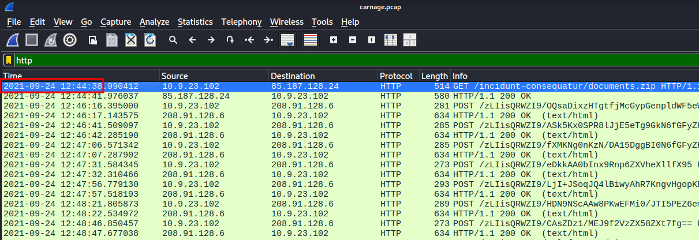
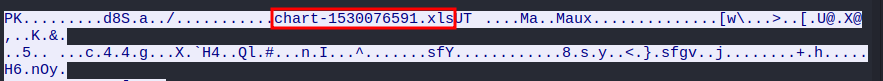
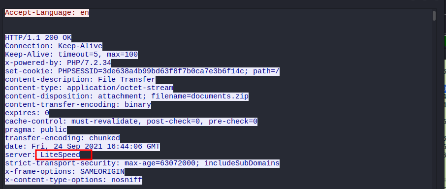
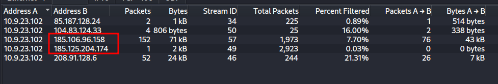
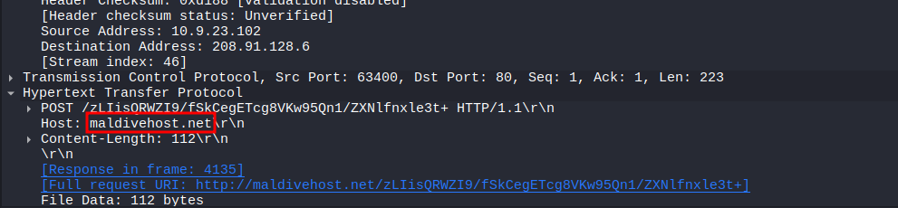
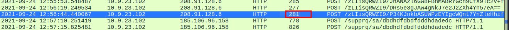
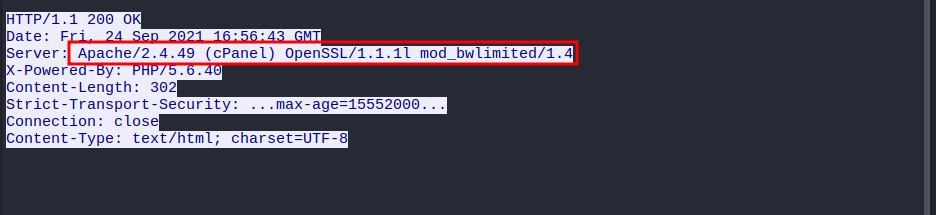
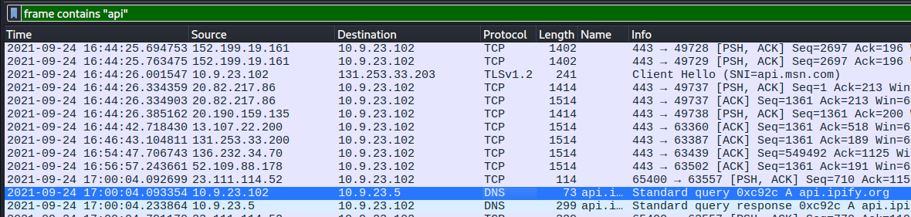
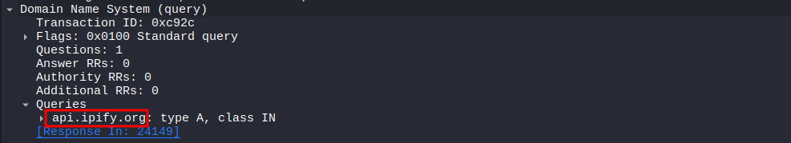
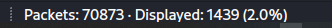

### Scenario
Eric Fischer from the Purchasing Department at Bartell Ltd has received an email from a known contact with a Word document attachment.  Upon opening the document, he accidentally clicked on "Enable Content."  The SOC Department immediately received an alert from the endpoint agent that Eric's workstation was making suspicious connections outbound. The pcap was retrieved from the network sensor and handed to you for analysis.
#### Task: Investigate the packet capture and uncover the malicious activities.

### Traffic Analysis
We are required to load the pcap file into Wireshark and answer the following questions. 

#### What was the date and time for the first HTTP connection to the malicious IP?
(answer format: yyyy-mm-dd hh:mm:ss)  
First task is to get the date and time when the first HTTP connection to the malicious IP occurred.  
I filtered the HTTP traffic. Then since the format required is yyyy-mm-dd hh:mm:ss , in the View tab in Wireshark change the Time Display Format.  
  
Answer: 2021-09-24 12:44:38

#### What is the name of the zip file that was downloaded?
Answer: documents.zip

#### What was the domain hosting the malicious zip file?
Here we are looking for the host.
  
Answer: attirenepal.com

#### Without downloading the file, what is the name of the file in the zip file?
We are told to find the name without downloading the zip file. Here I simply followed the HTTP traffic.
  
Answer: chart-1530076591.xls

#### What is the name of the webserver of the malicious IP from which the zip file was downloaded?
Follow HTTP or TCP stream.
  
Answer: LiteSpeed

#### What is the version of the webserver from the previous question?
  
Answer: PHP/7.2.34

#### Malicious files were downloaded to the victim host from multiple domains. What were the three domains involved with this activity?
Check the DNS traffic. 
TLS is used for HTTP encryption. I used a filter: _tls.handshake.type == 1_ and looked through the various Client Hello packets.    
Answer: finejewels.com.au, thietbiagt.com, new.americold.com

#### Which certificate authority issued the SSL certificate to the first domain from the previous question?
I followed TCP traffic for the domain: _finejewels.com.au_ and found something interesting.
  
Answer: GoDaddy

#### What are the two IP addresses of the Cobalt Strike servers? Use VirusTotal (the Community tab) to confirm if IPs are identified as Cobalt Strike C2 servers. (answer format: enter the IP addresses in sequential order)
This was a bit tricky though I managed. I filtered the HTTP traffic and found out that the victim IP was communicating with some external IPs. We are required to confirm if they are identified as Cobalt Strike C2 servers using VirusTotal.
  
Answer: 185.106.96.158,185.125.204.174

#### What is the Host header for the first Cobalt Strike IP address from the previous question?
Using VirusTotal as in the previous question, from the Community tab we can check the information.
  
Answer: oscp.verisign[.]com

#### What is the domain name for the first IP address of the Cobalt Strike server? You may use VirusTotal to confirm if it's the Cobalt Strike server (check the Community tab).
From the previous question, there is some information in the Community tab when using VirusTotal. Check the ‘C2 Server’.  
Answer: survmeter[.]live

#### What is the domain name of the second Cobalt Strike server IP?  You may use VirusTotal to confirm if it's the Cobalt Strike server (check the Community tab).
Answer: securitybusinpuff[.]com

#### What is the domain name of the post-infection traffic?
Here I filtered the http request method to POST: _http.request.method == POST_
  
Answer: maldivehost[.]net

#### What are the first eleven characters that the victim host sends out to the malicious domain involved in the post-infection traffic? 
From the POST data sent, we get the first eleven characters.  
Answer: zLIisQRWZI9

#### What was the length for the first packet sent out to the C2 server?
  
Answer: 281

#### What was the Server header for the malicious domain from the previous question?
Follow the HTTP stream.
  
Answer: Apache/2.4.49 (cPanel) OpenSSL/1.1.1l mod_bwlimited/1.4

#### The malware used an API to check for the IP address of the victim’s machine. What was the date and time when the DNS query for the IP check domain occurred? (answer format: yyyy-mm-dd hh:mm:ss UTC)
I filtered for frame that contain api: _frame contains “api”_  
We are required to submit the time in UTC so we need to change the time display to UTC via the View tab.
  
Answer: 2021-09-24 17:00:04

#### What was the domain in the DNS query from the previous question?
  
Answer: api[.]ipify[.]org

#### Looks like there was some malicious spam (malspam) activity going on. What was the first MAIL FROM address observed in the traffic?
I filtered for frames that contains “MAIL FROM”: _frame contains “MAIL FROM”_
  
Answer: farshin@mailfa[.]com

#### How many packets were observed for the SMTP traffic?
I filtered for the smtp traffic.  
  
Answer: 1439
