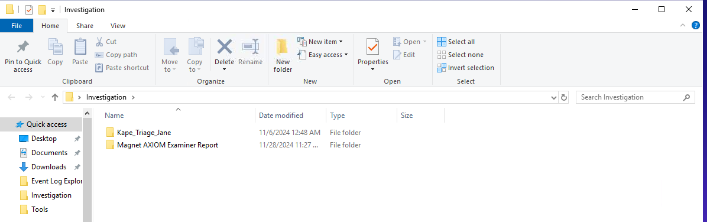
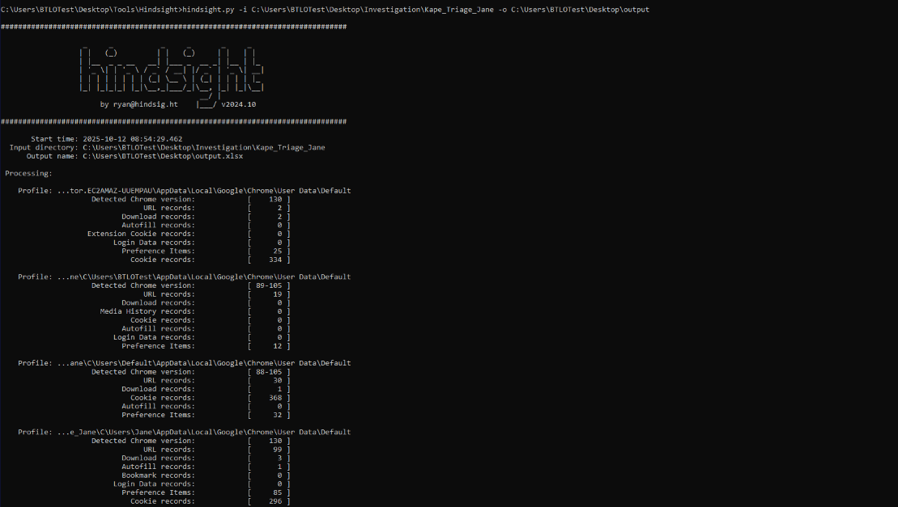
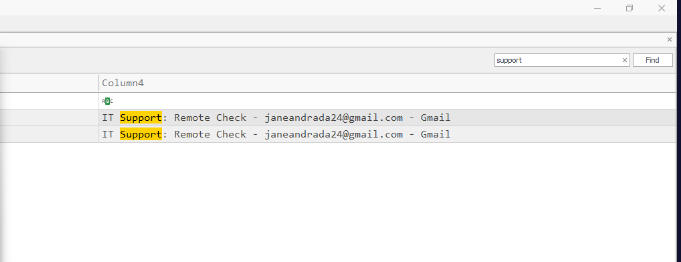
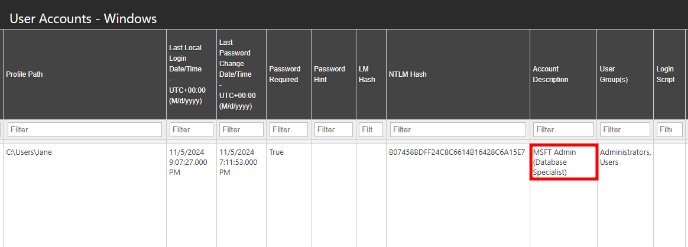
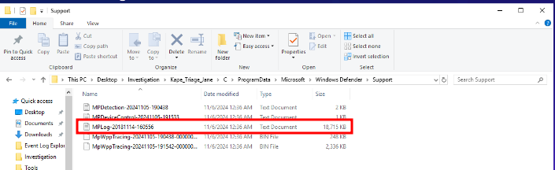
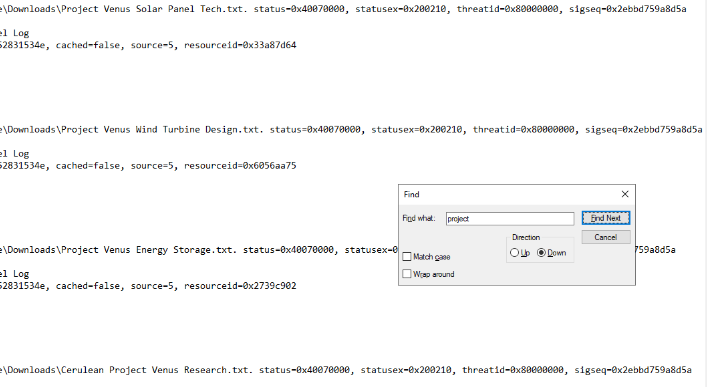

# CERULEAN - Digital Forensics Investigation
## Scenario
You’re the lead security analyst at Cerulean Inc., a respected manufacturer of industrial control systems. Your SIEM alerts you to suspicious RDP connections to the Production Department—especially Jane’s PC (the head of the department). It was determined later on that the attacks were malicious. You are tasked to analyze the triage artifacts on her computer and investigate the RDP connections for possible exfiltration.

## Introduction
The Cerulean lab is a digital forensics and incident response (DFIR) investigation focused on identifying and analyzing a malicious RDP intrusion within an industrial organization. The scenario simulates a real-world corporate breach at Cerulean Inc., where an attacker gained access through a phishing email disguised as an internal IT Support message. <br>
The challenge involves piecing together how the attacker moved from the initial phishing attempt to remote access and eventually to data exfiltration. To solve it, analysts must work with provided triage artifacts, browser history, and forensic reports to reconstruct the sequence of events, correlate evidence, and answer key investigative questions. <br>
The lab provides two main folders:
 - Tools
  <br>
 - Investigation <br>
  <br>

You can choose to work with either, but I decided to use a combination of both. I relied on the Magnet Axiom Examiner report for structured evidence review and leveraged forensic tools from the Tools folder, primarily Hindsight and Timeline Explorer (currently my favourite for these kind of cases) to manually validate and visualize the findings. <br>

## About the Tools
### Hindsight
_(Internet history forensics tool for Google Chrome/Chronium)_ <br>
Hindsight is an open-source tool used for analyzing web artifacts. It started as a Chrome history parser but now supports other Chromium-based browsers. It can extract and correlate data such as:
 - Visited URLs
 - Download history
 - Cache and cookies
 - Autofill data
 - Saved passwords
 - Extensions and preference <br>

Once the data is extracted from each file, it is correlated with data from other history files and placed on a timeline. <br>
Commandline usage: <br>
```
C:\\hindsight.py -i "C:\Users\Ryan\AppData\Local\Google\Chrome\User Data\Default" -o test_case
```
### TimelineExplorer
_(GUI tool for viewing and analyzing forensic timeline data)_ <br>
Timeline Explorer is a free Windows-based graphical tool developed by Eric Zimmerman for examining and filtering timeline data - typically CSV, TSV, or JSON files generated from forensic tools like Plaso, Hindsight, or MFTECmd. It allows analysts to efficiently search, sort, and filter through large datasets, making it much easier to investigate digital events chronologically. <br>
Timeline Explorer is particularly useful when reviewing web history, event logs, MFT records, or other forensic timelines where time-based correlation is key. <br>

## Investigation Process
To prepare the data for analysis, I ran Hindsight against the triage folder and exported the results for Timeline Explorer. <br>
Command used: <br>
```
C:\Users\BTLOTest\Desktop\Tools\Hindsight>hindsight.py -i C:\Users\BTLOTest\Desktop\Investigation\Kape_Triage_Jane -o C:\Users\BTLOTest\Desktop\output
```
 <br>
I then loaded the output CSV into Timeline Explorer, opened the Magnetic Axiom Examiner report, and got to work😎. <br>

## Investigation Submission
### When did Jane receive the malicious mail from an attacker pretending to be from IT Support? Check the web history to help us better timeline the series of events. (Format: YYYY-MM-DD HH:MM:SS UTC)
I filtered for the keyword “support” and found two emails from _jameandrada24@gmail.com_ with the subject line “IT Support: Remote Check”. <br>
 <br>
Answer: _2024-11-05 20:45:03 UTS_

### The threat actor immediately, after RDP’ing, tries to log into other storage-based resources. What is the one with the most traffic? (Format: Storage Name)
Filtering for “storage” revealed heavy traffic to Google Drive, indicating data exfiltration attempts. <br>
 <br>
Answer: _Google Drive_

### It looks like the threat actor’s motive is data exfiltration via RDP. What ITM ID corresponds with this technique? (Format: XXXXX.XXX)
I looked up the corresponding ITM (Insider Threat Matrix) technique ID related to data exfiltration using cloud storage. <br>
 <br>
Answer: _IF001.001_

### Let’s step back for a bit. Jane’s account mistakenly has admin rights. What role did they assign to her? (Format: Job Role (Title))
In the Magnetic Axiom Examiner Report, there is a section for User Accounts. On it, I found a User Group for Administrators for the Jane’s Account. <br>
 <br>
Answer: _MSFT Admin (Database Specialist)_

### It seems like she downloaded Slack before the RDP session. Our main point of communication is Teams, so this is strange. What is the installation date and time of this software? (Format: YYYY-MM-DD HH:MM:SS UTC)
Cerulean uses Teams internally, so seeing Slack installed raised a red flag. <br>
In the installed programs section of the Magnet report, I found the installation timestamp. <br>
 <br>
Answer: _2024-11-05 08:08:55 UTC_

### There is enough evidence of Slack being used on Jane’s machine. Can you provide the unofficial URL being utilized for communication? (Format: hxxps://url.tld)
By narrowing my search to Slack-related entries, I found traffic to a custom workspace URL using port 443 which is mostly used for communication. <br>
 <br>
Answer: _https[:]//ceruleaninc[.]slack[.]com_

### Provide the initial time and Origin IP Address for the RDP connections to Jane’s workstation. (Format: MM/D/YYYY H:MM:SSS XX UTC, XXX[.]XXX[.]XXX[.]XXX)
In the Magnetic Axiom Examiner Report, there is a section for connected devices and under it RDP. Since the connection was to Jane’s workstation, I filtered for Jane in the ‘Origin Service Name’. <br>
 <br>
Answer: _11/5/2024 8:58:38.883 UTC, 104[.]203[.]174[.]169_

### Our Project Venus plans were leaked, triggering the defenses. What are the four documents in alphabetical order? (Hint: examine the Windows Defender Logs) (Tip: remove 'project venus' and 'cerulean' from the document names). (Format: Doc1, Doc2, Doc3, Doc4)
As the hint suggests, I examined the Windows Defender Logs: <br>
 <br>
Opening the document and filtering for ‘project’, I got the documents that were leaked. <br>
 <br>
Answer: _Energy Storage.txt, Research.txt, Solar Panel Tech.txt, Wind Turbine Design.txt_

## Conclusion
The Cerulean investigation was a great hands-on exercise that tied together browser forensics, RDP analysis, and timeline correlation. <br>
Using Hindsight and Timeline Explorer made the process both structured and efficient, while the Magnetic Axiom Examiner report added depth for cross-verification. <br>

Thanks for reading! 😊