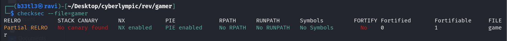
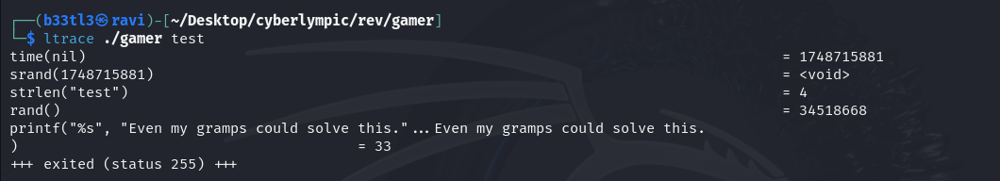
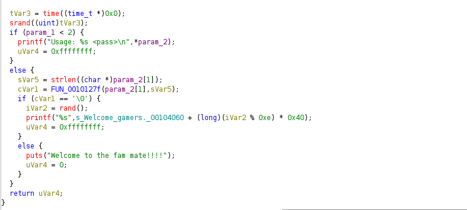
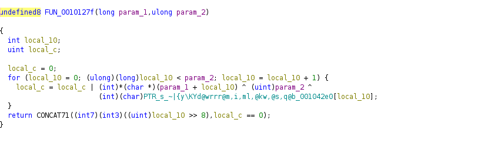
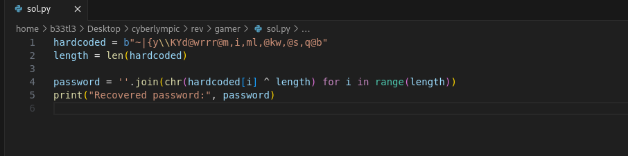
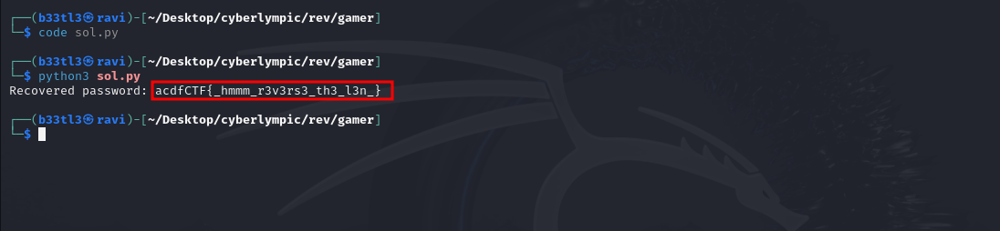

### Challenge Description
  
"Are you ready to play some game?"  
We are given an ELF binary named "gamer". When executed, it asks for a password. Our task is to reverse engineer the binary and find the correct input that will trigger the success message - and hopefully the flag. 

### Binary Inspection
Before diving into disassembly, we should inspect the binary to understand it's structure. I did this using cli commands: file and checksec. 
Using _file_, we get:   
This tells us that:  
    - The binary is a 64-bit Linux executable.  
    - It uses Position Independent Execution (PIE) - so code addresses are randomized at runtime.  
    - Stripped binary - no symbols (function names) to help us, making reversing slightly harder.  

Using _checksec_, we get:     
This tells us:  
    - No stack canary: Buffer overflows might be exploitable.  
    - NX enabled: Prevents shellcode execution from the stack.  
    - PIE: Makes static addresses useless - needs runtime analysis or relative offsets.  

### Running the binary
We need to change the binary to an executable using 'chmod +x'. Executing the binary:     
It requires a password argument. I tried a dummy input, 'test', and it printed a taunt. Let's figure out what is happening on under the hood.

### String Analysis
I ran strings to get the readable content from the binary: strings gamer
I found some interesting stuff. "Welcome to the fam mate!!!" - Likely the success message.
Several failure messages like "No, you are not getting it.", "Oops! That wasn't it.", "Even my gramps could solve this."
There is a strange string: "~|{y\KYd@wrrr@m,i,ml,@kw,@s,q@b". 

### Using ltrace
To observe runtime behavior without disassembly, I used 'ltrace':     
We observe:  
    - The program seeds 'rand()' with the current time (for randomness).  
    - It then calls 'strlen()' on the input.  
    - A call to 'rand()' is used, probably to pick a random failure message.  
    - Then the program prints a string.  
The key logic must be hiding in a function that processes the password input.

### Static Analysis (via Ghidra)
I found some interesting functions via ghidra.
#### Functions Overview
Here is a piece of the first function:     
To interpret the function, I made a few changes to the variable names. The function seeds randomness for error message selection, calls another function, 'FUN_0010127f'. 
If the function returns '0' (false), you get a random failure message. If it returns 'non-zero' (true), you get the winning message.
The other interesting function is FUN_0010127f, which is called by the first function.
  
I noticed a hardcorded byte array being compared with transformed input characters. The function performs XOR-based validation. For it to return true, each character must satisfy: input[i] = hardcoded[i] ^ len
The hardcorded array (exactly what we saw earlier) is: ~|{y\KYd@wrrr@m,i,ml,@kw,@s,q@b
We know that the password length must be equal to the length of the array, which is 32.

Now to reconstruct the password, we need to write a script to reverse the XOR logic.  
  
Running the script, I get the flag.  
  
The output -  
Recovered password: acdfCTF{_hmmm_r3v3rs3_th3_l3n_}
