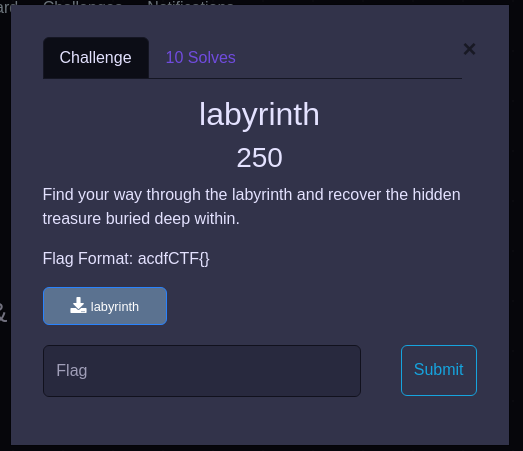
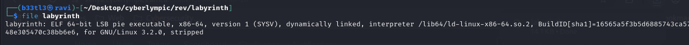
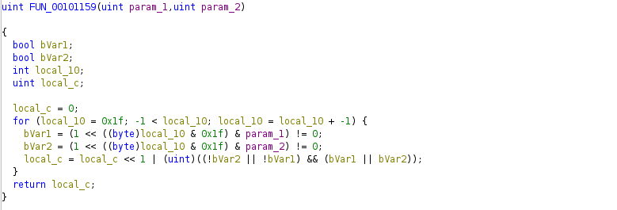
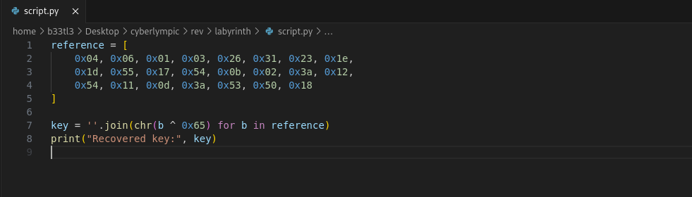
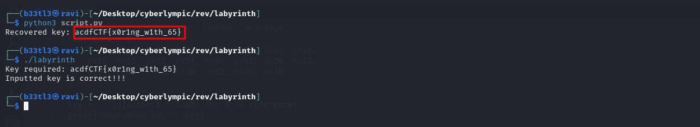

### Introduction

We are provided with a 64-bit stripped ELF binary named _labyrinth_. Our goal is to reverse engineer it and extract a valid key (flag) that the binary will accept.

### Initial Recon
Using _file_:  

  - Stripped: No debug symbols
  - PIE-enabled: Randomized load addresses
  - Dynamically linked: Uses standard libraries at runtime

Using _checksec_:  

Runtime behavior:  

We are prompted for a key. 

Using _ltrace_:  

This confirms that it takes input with 'scanf'.
It immediately checks the key and outputs a result - no system-level calls, so everything is done internally.

### Static Analysis using Ghidra
I loaded the binary into Ghidra and started exploring. I found some interesting functions.  
FUN_00101159:    
This is an XOR operation implemented bitwise. The function takes two 32-bit integers and applies a bit-by-bit XOR operation. Returns the 32-bit XOR result of param_1 and param_2.

FUN_001011dd:   
This is the main key-checking routine. It:
  - Prompts the user for input.
  - Loops over 23 characters of the input. 'local_28 = &DAT_00102004;' points to 23 reference bytes stored in the binary. These represent the correct characters XORed with 0x65.
  - Compares each character after some obfuscation.
  - Aggregates errors using a bitwise OR (|).
  - If there is no error, the key  is correct.  

Reference bytes, DAT_00102004:  

Using this, we can write a decoding script.

Then we get our flag: 
Flag: _acdfCTF{x0r1ng_w1th_65}_
