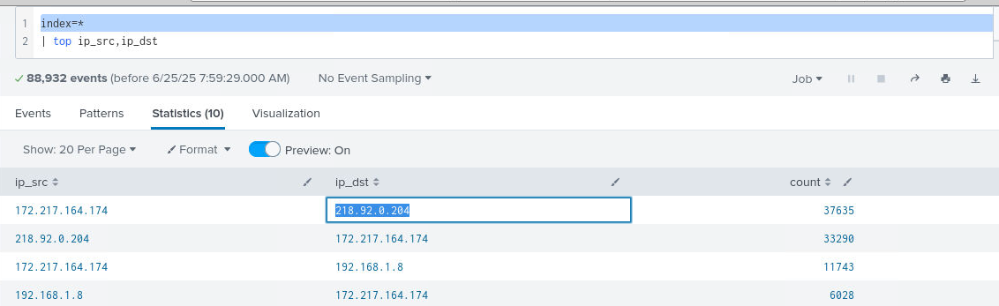
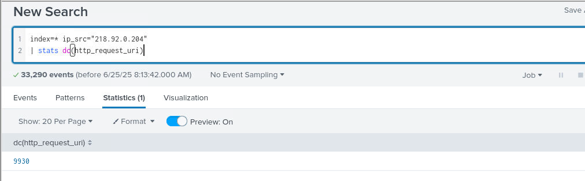
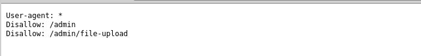
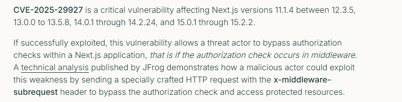
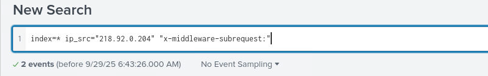
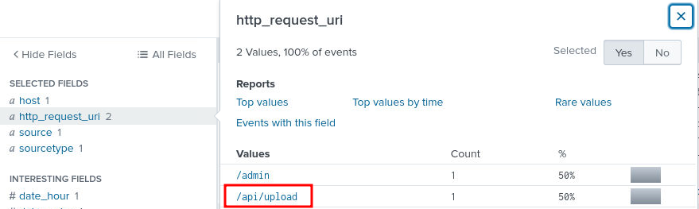
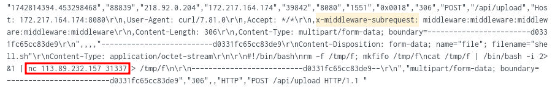

## Scenario
The security team at MiddleMayhem Inc. has detected unusual network traffic to their admin portal, but no security breaches have been confirmed. Your SOC team has been provided with SIEM logs from the incident. Analyze the attack pattern to determine how attackers bypassed authentication, gained remote code execution, and moved laterally through the network.


## Introduction
MiddleMayHem is a blue team investigation lab on BTLO that simulates a real-world web application breach. In this scenario, I took on the role of a SOC analyst tasked with reviewing SIEM logs in Splunk after unusual traffic was detected targeting the company’s admin portal. This investigation walks you through every stage of the attack chain - from identifying the attacker’s IP and mapping their reconnaissance, to spotting a CVE-based authentication bypass, analyzing post-exploitation activity like reverse shell uploads, and finally detecting lateral movement across the network. This lab is a hands-on way to practice threat hunting, log analysis, and CVE research while thinking like an attacker and defending like an analyst.

## Step by step Investigation
### Access the Website in the browser, present it in the bookmark, and identify the JavaScript framework and version used.
This was kind of straight-forward. All I needed to do is open the target site which was bookmarked on the browser. <br>
 <br>
Answer: _Next.js 15.0.0_

### Using Splunk, Find the attacker’s IP address
After running Splunk, I searched for unusual network traffic. <br>
 <br>
```
index=* sourcetype=* | stats count by ip_src, ip_dst | sort - count
```
Attackers often generate abnormal event volumes - either by scanning or brute forcing. Sorting by count is a quick way to spot them. By looking at the IP address with the highest number of events. <br>
Answer: _218.92.0.204_

### Analyze the SIEM logs to determine how many unique URIs were accessed by the attacker.
 <br>
Answer: _9930_

### Explore the site and identify two specific locations that could reveal internal structures or potential access points not meant for public eyes. Provide the two relative URLs.
If it's not meant for public eyes, it is disallowed on robots.txt. Checking this quickly gave me two uris. <br>
 <br>
Answer: _/admin,/admin/file-upload_

### Based on the Framework and Version, what recent CVE could be used to bypass authorization?
Now the juicy part. <br>
With Next.js 15.0.0 identified, I researched recent CVEs and found: CVE-2025-29927 - an auth bypass in Next.js middleware. <br>
 <br>
Answer: _CVE-2025-29927_

### Find the relevant HTTP header in the SIEM logs that indicates CVE exploitation. Provide the header name. 
With more research, I found out that the vulnerable header that the CVE exploits is 'x-middleware-subrequest'. <br>
 <br>
Adding this to the search confirmed it. <br>
 <br>
Answer: _x-middleware-subrequest_

### What interesting URI did the attacker access after exploiting the CVE?
Using the header name identified, x-middleware-subrequest , I looked at the events, specifically the fields. In this, I focused on ‘http_request_uri’. <br>
 <br>
Answer: _/api/upload_

### The attacker tried uploading a reverse shell. Find out the IP and port to which the target would connect once the connection is established.
From those events, there are mentions of shell and nc. Ideally, an attacker would listen using nc to get a shell. <br>
 <br>
Answer: _113.89.232.157:31337_

### After compromising the WebApp server, the attacker attempted lateral movement. Identify the technique used, as recorded in the SIEM logs.
Most lateral movements are usually bruteforces. So I looked for a password bruteforce. <br>
I searched for ‘password’, and I saw several failed and one successful login via ssh. The technique associated with this is ssh bruteforce. <br>
 <br>
Answer: _ssh bruteforce_

### Identify the user account that achieved successful lateral movement to another server.
 <br>
Answer: _dbserv_

## Conclusion and Lessons Learned
MiddleMayHem was an excellent exercise in end-to-end incident investigation. It reinforced how important it is to start with broad hunting queries, then pivot and drill down into specific attacker actions. Identifying unusual IP activity led to discovering targeted enumeration of sensitive endpoints, which tied directly to a known Next.js CVE. From there, analyzing headers and URIs revealed how the attacker bypassed authentication, dropped a reverse shell, and moved laterally using brute force over SSH. <br>

This lab sharpened my Splunk search skills, improved my ability to spot subtle attack signals, and reminded me how valuable structured, methodical investigation is when responding to real-world incidents.