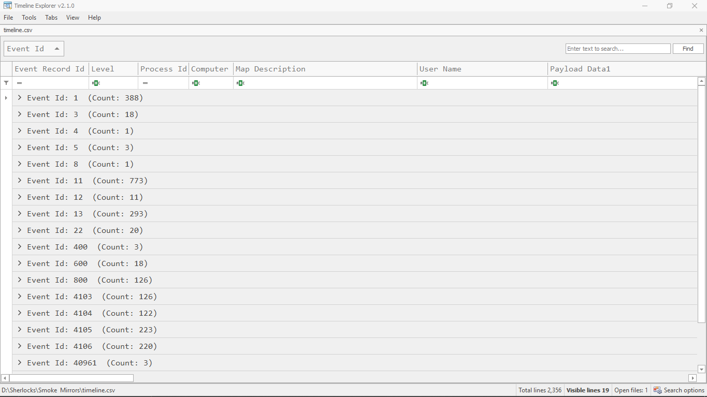
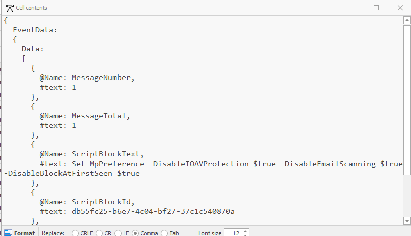
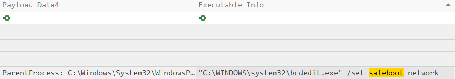
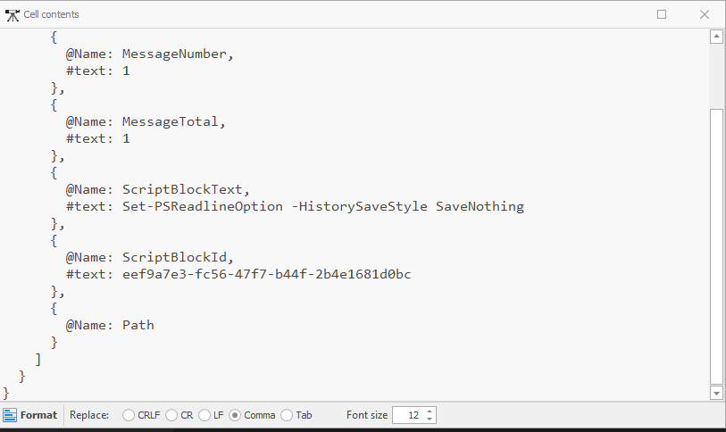

## Sherlock Scenario
Byte Doctor Reyes is investigating a stealthy post-breach attack where several expected security logs and Windows Defender alerts appear to be missing. He suspects the attacker employed defense evasion techniques to disable or manipulate security controls, significantly complicating detection efforts.
Using the exported event logs, your objective is to uncover how the attacker compromised the system's defenses to remain undetected. <br>

## Analysis
Given a zip file with 3 event log files. 
 - Microsoft-Windows-Powershell.evtx
 - Microsoft-Windows-Powershell-Operational.evtx
 - Microsoft-Windows-Sysmon-Operational.evtx
I used evtxe tool to combine the event logs into one csv file:

```
D:\Tools\EvtxeCmd>EvtxECmd.exe -d "D:\Sherlocks\Smoke & Mirrors" --csv "D:\Sherlocks\Smoke & Mirrors" --csvf timeline.csv
EvtxECmd version 1.5.2.0

Author: Eric Zimmerman (saericzimmerman@gmail.com)
https://github.com/EricZimmerman/evtx

Command line: -d D:\Sherlocks\Smoke & Mirrors --csv D:\Sherlocks\Smoke & Mirrors --csvf timeline.csv

CSV output will be saved to D:\Sherlocks\Smoke & Mirrors\timeline.csv

Maps loaded: 453
Looking for event log files in D:\Sherlocks\Smoke & Mirrors


Processing D:\Sherlocks\Smoke & Mirrors\Microsoft-Windows-Powershell-Operational.evtx...
Chunk count: 32, Iterating records...

Event log details
Flags: None
Chunk count: 32
Stored/Calculated CRC: 236166C2/236166C2
Earliest timestamp: 2025-04-10 06:12:10.4538637
Latest timestamp:   2025-04-10 06:38:43.5656333
Total event log records found: 701

Records included: 701 Errors: 0 Events dropped: 0

Metrics (including dropped events)
Event ID        Count
4103            126
4104            122
4105            223
4106            220
40961           3
40962           3
53504           4

Processing D:\Sherlocks\Smoke & Mirrors\Microsoft-Windows-Powershell.evtx...
Chunk count: 4, Iterating records...

Event log details
Flags: None
Chunk count: 4
Stored/Calculated CRC: 97423E76/97423E76
Earliest timestamp: 2025-04-10 06:14:18.1108730
Latest timestamp:   2025-04-10 06:38:43.5651475
Total event log records found: 147

Records included: 147 Errors: 0 Events dropped: 0

Metrics (including dropped events)
Event ID        Count
400             3
600             18
800             126

Processing D:\Sherlocks\Smoke & Mirrors\Microsoft-Windows-Sysmon-Operational.evtx...
Chunk count: 30, Iterating records...

Event log details
Flags: None
Chunk count: 30
Stored/Calculated CRC: F68E4CD5/F68E4CD5
Earliest timestamp: 2025-04-10 06:00:32.6909201
Latest timestamp:   2025-04-10 06:41:43.4689290
Total event log records found: 1,508

Records included: 1,508 Errors: 0 Events dropped: 0

Metrics (including dropped events)
Event ID        Count
1               388
3               18
4               1
5               3
8               1
11              773
12              11
13              293
22              20

Processed 3 files in 11.6119 seconds
```


Quick summary of each event log:
 - Microsoft-Windows-Powershell.evtx
    - Channel → Windows PowerShell.
    - Purpose → High-level, summary only PowerShell session logs.
    - Event IDs:
        - 400 → PowerShell engine started.
        - 403/600  → PowerShell engine stopped.
        - 800 → Pipeline execution details (basic command usage).
    - The event logs tells us:
        - When PowerShell was launched. 
        - When it exited.
        - Basic command invocation events.
        - Whether PowerShell was used multiple times during the intrusion window.
 - Microsoft-Windows-Powershell-Operational.evtx
    - Channel → PowerShell/Operational
    - Purpose: Detailed PowerShell operational auditing, including script block logging, module loads, providers, etc.
    - Event IDs:
        - 4103 → Module logging - Records detailed info about PowerShell modules and internal commands.
        - 4104 → Script Block Logging - Shows the actual executed PowerShell code.
        - 4105 → Script block start.
        - 4106 → Script block end.
        - 40961/40962 → AMSI scanning events (malicious script detected, AMSI blocked, etc.).
        - 53504 → PowerShell transcript/logging settings changed.
    - The event logs tells us:
        - The exact PowerShell commands ran.
        - Whether the attacker used obfuscation. Whether AMSI detected or blocked anything.
        - Which modules or providers were used.
 - Microsoft-Windows-Sysmon-Operational.evtx
    - Channel → Sysmon/Operational (from Sysinternals Sysmon).
    - Purpose → High-fidelity security monitoring across processes, files, registry, and networking.
    - Event IDs:
        - 1 → Process creation.
        - 3 → Network connections.
        - 4 → Sysmon Service State Change.
        - 5 → Process termination.
        - 8  → CreateRemoteThread (process injection).
        - 11 → File create.
        - 12 → Registry Object create/open.
        - 13 → Registry value set.
        - 22 → DNS query.
    - The event log tells us the attacker behaviour including:
        - What processes they launched (ID 1).
        - What network connections PowerShell or malware opened (ID 3).
        - What files they dropped (ID 11).
        - Registry persistence changes (IDs 12 and 13).
        - DNS lookups to C2 infrastructure (ID 22).
        - Potential injection or memory tampering (ID 8).

## Brainstorming
Parsing the csv file with timeline explorer.


## Questions
### The attacker disabled LSA protection on the compromised host by modifying a registry key. What is the full path of that registry key?
Answer: _HKLM\System\CurrentControlSet\Control\Lsa_

### Which PowerShell command did the attacker first execute to disable Windows Defender?
Event ID 4104 → Shows the actual PowerShell code. Filtering for ‘disable’ in the global filter.

Answer: _Set-MpPreference -DisableIOAVProtection $true -DisableEmailScanning $true -DisableBlockAtFirstSeen $true_

### The attacker loaded an AMSI patch written in PowerShell. Which function in the DLL is being patched by the script to effectively disable AMSI?
Event ID 40961/40962 → AMSI scanning events - this gave no logs. <br>
Event ID 4104 → powershell code. <br>
Filtered for amsi → got nothing. <br>
Found this in one of the disable scripts:
```
        @Name: ScriptBlockText,
        public static bool Patch() {
              ,         IntPtr h = GetModuleHandle(""a"" + ""m"" + ""s"" + ""i"" + "".dll"");,         if (h == IntPtr.Zero) return false;,         IntPtr a = GetProcAddress(h, ""A"" + ""m"" + ""s"" + ""i"" + ""S"" + ""c"" + ""a"" + ""n"" + ""B"" + ""u"" + ""f"" + ""f"" + ""e"" + ""r"");, }

```
The script uses GetProcAddress to get AmsiScanBuffer: GetProcAddress(h, ""A"" + ""m"" + ""s"" + ""i"" + ""S"" + ""c"" + ""a"" + ""n"" + ""B"" + ""u"" + ""f"" + ""f"" + ""e"" + ""r""); <br>
Answer: _AmsiScanBuffer_

### Which command did the attacker use to restart the machine in Safe Mode?
Event ID 1 → process creation. <br>
Filtered for ‘safeboot’. <br>

Answer: _bcdedit.exe /set safeboot network_

### Which PowerShell command did the attacker use to disable PowerShell command history logging?
Event ID 4104. <br>
Attackers disable PowerShell’s command history logging by modifying the PsReadLine settings. <br>
Filtering for PsReadline. <br>

Answer: _Set-PSReadlineOption -HistorySaveStyle SaveNothing_