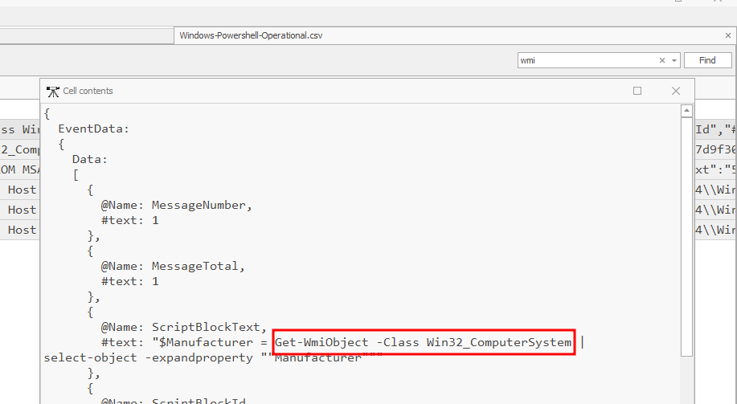

## Sherlock Scenario
Talion suspects that the threat actor carried out anti-virtualization checks to avoid detection in sandboxed environments. Your task is to analyze the event logs and identify the specific techniques used for virtualization detection. Byte Doctor requires evidence of the registry checks or processes the attacker executed to perform these checks.

## Brainstorming
My task is to analyze the provided PowerShell event logs and determine how the attacker attempted to detect virtualization, including the WMI classes, registry keys, and processes used during execution. <br>
Anti-virtualization checks → techniques used by malware or software to detect if they are running in a virtual machine or sandbox, rather than a physical machine. <br>
If virtualization is detected, malware often changes behavior or terminates execution to avoid analysis. <br>
Since PowerShell was used, I expect these checks to appear in PowerShell execution logs, especially script block logging. <br>

### Logs provided for Analysis
Two PowerShell-related event logs were provided:
 - Microsoft-Windows-PowerShell
 - Windows-PowerShell-Operational

These logs are in .evtx format, so I first converted them to .csv for easier filtering and timeline analysis. 

### Tooling
Tool Used: Eric Zimmerman’s EvtxECmd <br>
This tool allows parsing EVTX files and exporting them as CSV files, which can then be analyzed using Timeline Explorer.

### Converting Event Logs to CSV
**Microsoft-Windows-PowerShell.evtx** <br>
```
.\EvtxECmd.exe -f "D:\Sherlocks\Phantom Check\Microsoft-Windows-Powershell.evtx" --csv "D:\Sherlocks\Phantom Check" --csvf Microsoft-Windows-Powershell.csv
```
Result:
 - Total events: 567
 - Time range: 2025-01-25 → 2025-04-09

Event ID breakdown:
 - 400 – PowerShell engine start
 - 403 – PowerShell engine stop
 - 600 – Provider initialization
 - 800 – Command / pipeline execution
This log gives high-level PowerShell execution context.<br>

**Windows-PowerShell-Operational.evtx**
```
.\EvtxECmd.exe -f "D:\Sherlocks\Phantom Check\Windows-Powershell-Operational.evtx" --csv "D:\Sherlocks\Phantom Check" --csvf Windows-Powershell-Operational.csv
```
Result:
 - Total events: 631
 - Time range: 2025-04-08 → 2025-04-09

Event ID breakdown:
 - 4103 – Executing pipeline
 - 4104 – Script block logging
 - 4105 – Command started
 - 4106 – Command stopped
 - 40961 – PowerShell console startup
 - 40962 – PowerShell console exit
 - 53504 – Module logging

This log is more valuable because Event ID 4104 records the actual PowerShell code executed.

### Analysis Approach
I loaded both CSV files into Timeline Explorer and focused primarily on:
 - Event ID 4104 (script block logging)
 - Event ID 4103 (pipeline execution)
 - Event ID 800 (command output)

## Questions
### Which WMI class did the attacker use to retrieve model and manufacturer information for virtualization detection?
WMI(Windows Management Instrumentation) → Microsoft’s implementation of the Common Information Model(CIM) → is a standardized way to represent and query information about system components. <br>
To detect virtualization, attackers often query system manufacturer and model information via WMI. <br>
I filtered the Windows-PowerShell-Operational log for WMI-related script blocks. <br>
 
Answer: _Win32_ComputerSystem_

### Which WMI query did the attacker execute to retrieve the current temperature value of the machine?
Virtual machines usually do not expose real thermal sensors. Querying temperature is a known anti-VM technique. <br>
[](query.png)
Answer: _SELECT * FROM MSAcpi_ThermalZoneTemperature_

### The attacker loaded a PowerShell script to detect virtualization. What is the function name of the script?
I filtered for Event ID 4104 and searched for script blocks containing the keyword 'vm'. <br>
[](func.png)
Answer: _Check-VM_

### Which registry key did the above script query to retrieve service details for virtualization detection?
Inside the Check-VM function, I observed a registry enumeration used to identify virtualization-related services.<br>
```$hyperv = Get-ChildItem HKLM:\SYSTEM\ControlSet001\Services```
This path commonly contains Hyper-V service entries. <br>
Answer: _HKLM:\SYSTEM\ControlSet001\Services_

### The VM detection script can also identify VirtualBox. Which processes is it comparing to determine if the system is running VirtualBox?
The Check-VM function also attempts to identify VirtualBox by checking for known running processes. <br>
```
 #Virtual Box
     $vb = Get-Process
     if (($vb -eq "vboxservice.exe") -or ($vb -match "vboxtray.exe"))
         {
     
         $vbvm = $true
     
         }
```
Answer: _vboxservice.exe, vboxtray.exe_

### The VM detection script prints any detection with the prefix 'This is a'. Which two virtualization platforms did the script detect?
The script prints detection results using the prefix “This is a”. <br>
I searched the Microsoft-Windows-PowerShell.csv file for this phrase and found output matching the time of script execution. The time corresponds with the time the script was executed: _2025-04-09 09:20:55_ <br>
[](print.png)
Answer: _Hyper-V, VMWare_

## Final Understanding
Based on the PowerShell logs, the attacker executed a custom PowerShell function (Check-VM) that performed multiple anti-virtualization checks, including:
 - WMI queries for system model and temperature sensors
 - Registry enumeration for Hyper-V services
 - Process checks for VirtualBox components
 - Output confirmation of detected virtualization platforms

This confirms a deliberate attempt to detect and evade execution in virtualized or sandboxed environments. <br>
<br>
Thanks for reading! 😊