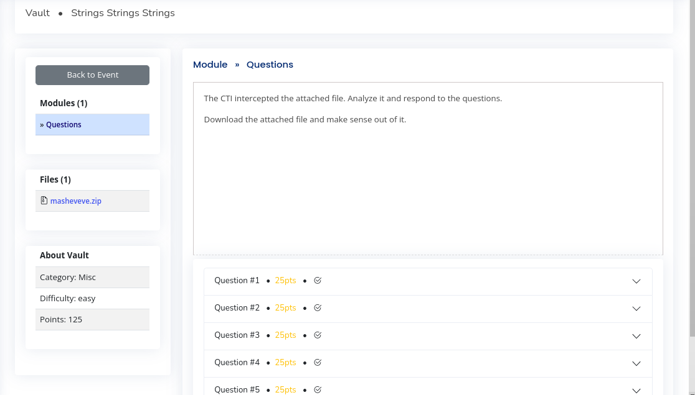
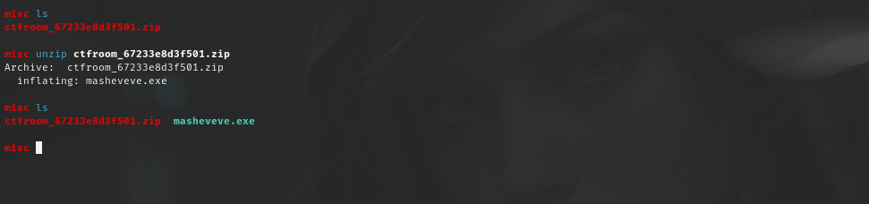
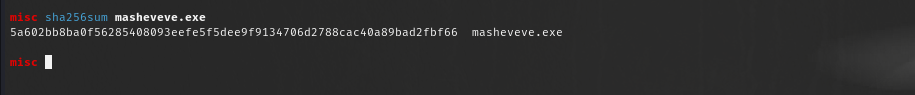
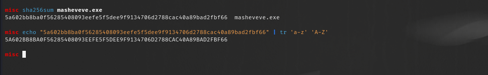
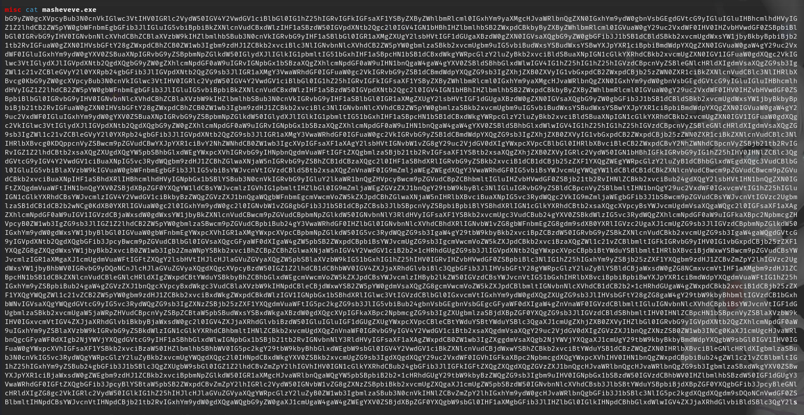
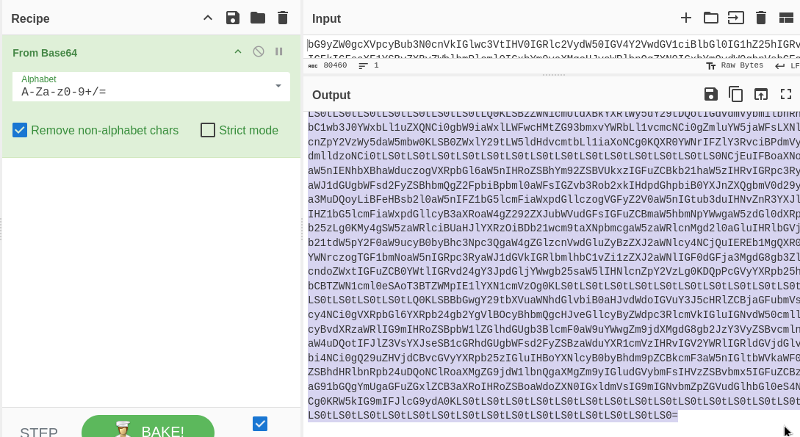
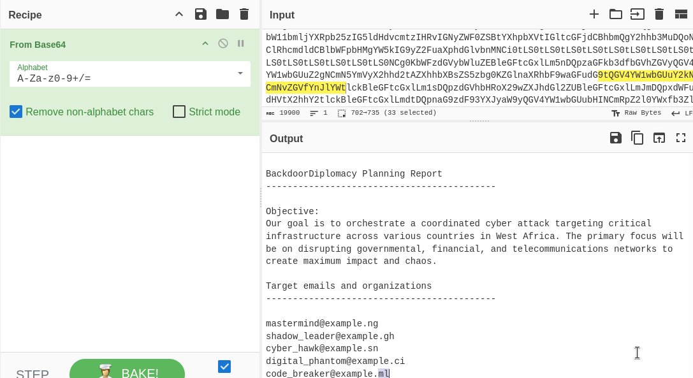
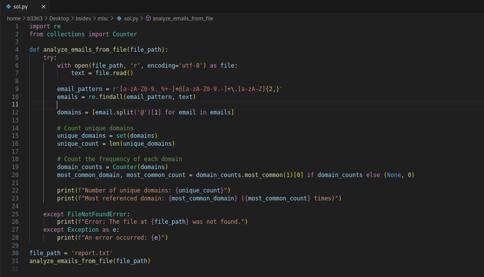

### Introduction
Welcome to my first blog! I'm excited! In this blog post, we'll explore a Misc challenge.It was a challenge set by Bsides to select the first fifteen hackers and sponsor them to the event.I hope you will enjoy it!

We are required to answer the following questions:  
Question 1: What is the SHA256 Hash of the file ? Enter your answers in upper case 
Question 2: How many emails from the BackdoorDiplomacy Planning Report have Senegal ccTLD 
Question 3: Based on the previous questions, how many unique domains are in the report? 
Question 4: Which domain is referenced the most ? eg example.com 
Question 5: Which attack vectors are being used by the threat actor? 
            Ransomware attack 
            Phishing Campaigns 
            Exploiting Vulnerabilities 
            Insider Threats 
            DDoS Attacks 

We are given a zip file: _masheveve.zip_. After downloading the file, we do a 'unzip misheveve.zip' command on our terminal. 

### Question 1
**SHA256 Hash of the file.** 
We need to check the type of our file first, using command _file <filename>_. Upon checking, we find out it has ASCII text.

Since we are asked to provide the SHA256 Hash of the file, we _'sha256sum <filename>'_. 

We find the hash of the file, but we are asked to submit it in uppercase. So we _tr_ command. 

Our flag: _5A602BB8BA0F56285408093EEFE5F5DEE9F9134706D2788CAC40A89BAD2FBF66_

### Question 2
**We are asked to provide the number of emails from BackdoorDiplomacy Planning report that have Senegal ccTLD.** 
We are to look for emails with '_.sn_'.

Let's go on and cat the file.  Woah! We find that it a long bunch of text that we can't read. But at the end of file, we see a sign that it might be base64 encoded. 
Let's move it to our '_cyber kitchen'_ and see what we can do about the unreadable text. On CyberChef, we decode our text using base64 decode, and sadly we get a bunch of 'loren ipsum' text. 

Reading through the 'loren ipsum' text, we can find a block of base64 encoded text.  Interesting. Let's decode it again and see what we have. After decoding, we get a readable report. Yippee! 

Smooth. Now that we have a readable report, let's copy it and save it as _report.txt_. Let's open our file using sublime text. We are asked the number of emails with _.sn_. Using _'ctrl find'_, we find that there are 15 emails. 
Our flag: _15_

### Question 3
**Unique domains in the report.** 
Let's write a python script that will help us get the number of unique domains from the report. We will use the script to solve both Question 3 and Question 4.

On running the script, we find that the number of unique domains is 39.

Our flag: _39_

### Question 4
**Most referenced domain** 
From our script, we get that the most referenced domain is: example.tg 
Our flag: _example.tg_

### Question 5
**Attack vectors** 
This question is quite straight forward as it asks us to select the attack vectors used by the threat actor. From our report, at the end of the file, there is a section on Attack Vector Overview.

We select all the four except _Ransomware attack_.

Yay! We are done!
I hope you enjoyed the blog:)
