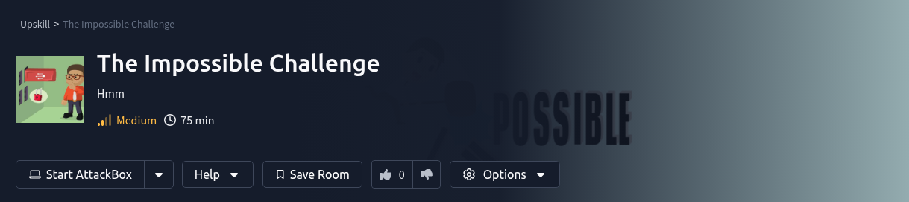
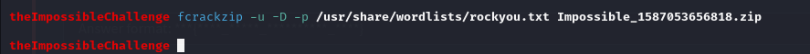
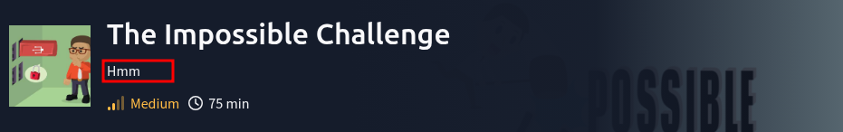
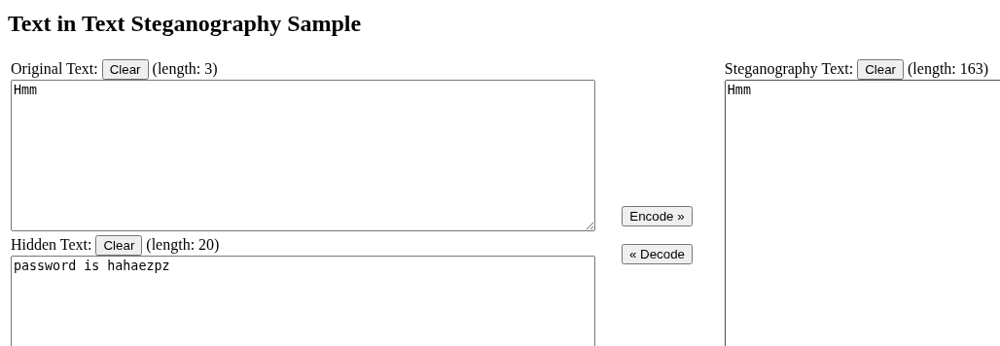

 <br>

In this Impossible Challenge, the task looks simple: <br>
**Download a file and find the flag. Easy, right?**
 <br>
Well… not quite. <br>
Downloading the file gives us a zip archive called **Impossible_1587053656818.zip**. Checking its contents reveals a single file inside - flag.txt - which clearly holds our precious flag. <br>
But here’s the catch - the zip file is password-protected. And as the challenge name suggests, the password isn’t going to be as easy as "1234". <br>
Well, let’s find the password!

## The Hunt Begins - Decoding Madness
On the challenge dashboard, there’s a string of creepy, cryptic text that looks like a broken keyboard gave up on life:
```
qo qt q` r6 ro su pn s_ rn r6 p6 s_ q2 ps qq rs rp ps rt r4 pu pt qn r4 rq pt q` so pu ps r4 sq pu ps q2 su rn on oq o_ pu ps ou r5 pu pt r4 sr rp qt pu rs q2 qt r4 r4 ro su pq o5
```
This... means something. Probably. <br>
But staring at it wasn’t helping. I tried everything - ROT13, ROT47, brute force. Heck, I even fired up _fcrackzip_, adjusted my hoodie, and dimmed the lights. Felt like Mr. Robot for a minute… until my CPU started wheezing like a cat with asthma. <br>
**Result**: Overheated CPU, zero cracked passwords. <br>
Turns out I’m just a guy who thinks he’s hacking but is really melting his CPU over a zip file named ‘Impossible_1587053656818.zip’. <br>
 <br>

## Time to cook with CyberChef
Alright, back to decoding. I tossed the string into CyberChef and started experimenting with different recipes. <br>
ROT13 and ROT47 made some sense. <br>
Combining both gave me this value:
```
53 58 51 6e 63 79 42 70 62 6e 4e 70 5a 47 55 67 64 47 68 6c 49 48 52 6c 65 48 51 73 49 47 6c 75 49 47 5a 79 62 32 35 30 49 47 39 6d 49 48 6c 76 64 58 49 67 5a 58 6c 6c 63 79 45 3d
```
Looks like hex! <br>
Decoding from Hex gave me a base64 string, so progress at last:
```
SXQncyBpbnNpZGUgdGhlIHRleHQsIGluIGZyb250IG9mIHlvdXIgZXllcyE=
```
Decode that and I get…
 <br>
No password yet, more of a hint. Tells us that that it has been in front of our eyes the whole time.

## Recon - Steganography
The hint says that “It’s inside the text, in front of your eyes!”. This screams steganography inside text. <br>
Time to look for the unusual. I copied every chunk of text from the dashboard into VSCode, hoping to see something... weird.
 <br>
The ‘Hmm’ text looks interesting. Pasting it in a search box there is a cursor jump. This suggests that there are some hidden but present characters. <br>
This is textbook ***zero-width steganography** - data hidden in Unicode characters that don’t display on screen but still exist in the text. <br>
To confirm, I tossed it into Python:
```
impossible = "Hmm\u200c\u200c\u200c\u200c\u200d\u202c\u200c\u200d\u200c\u200c\u200c\u200c\u200d\ufeff\u200c\ufeff\u200c\u200c\u200c\u200c\u200d\ufeff\u200c\ufeff\u200c\
\u200c\u200c\u200c\u200d\ufeff\u200d\ufeff\u200c\u200c\u200c\u200c\u200d\u202c\ufeff\ufeff\u200c\u200c\u200c\u200c\u200d\ufeff\u200c\u202c\u200c\u200c\u200c\u200c\
\u200d\u202c\u200d\u200c\u200c\u200c\u200c\u200c\u200c\u202c\u200c\u200c\u200c\u200c\u200c\u200c\u200d\u202c\u202c\u200d\u200c\u200c\u200c\u200c\u200d\ufeff\u200c\
\ufeff\u200c\u200c\u200c\u200c\u200c\u202c\u200c\u200c\u200c\u200c\u200c\u200c\u200d\u202c\u202c\u200c\u200c\u200c\u200c\u200c\u200d\u202c\u200c\u200d\u200c\u200c\
\u200c\u200c\u200d\u202c\u202c\u200c\u200c\u200c\u200c\u200c\u200d\u202c\u200c\u200d\u200c\u200c\u200c\u200c\u200d\u202c\u200d\u200d\u200c\u200c\u200c\u200c\u200d\
\ufeff\u202c\u202c\u200c\u200c\u200c\u200c\u200d\ufeff\u200c\u200c\u200c\u200c\u200c\u200c\u200d\ufeff\u202c\u202c"‌‌‌‍‌‌‌‌‌‍‌‌‌‌‌‍‍‌‌‌‌‍‬‌‌‌‌‍‌‬‌‌‌‌‍‬‍‌‌‌‌‌‌‬‌‌‌‌‌‌‍‬‬‍‌‌‌‌‍‌‌‌‌‌‌‬‌‌‌‌‌‌‍‬‬‌‌‌‌‌‍‬‌‍‌‌‌‌‍‬‬‌‌‌‌‌‍‬‌‍‌‌‌‌‍‬‍‍‌‌‌‌‍‬‬‌‌‌‌‍‌‌‌‌‌‌‍‬‬
```
**Zero-width** characters are Unicode characters that do not occupy any visible space when displayed in text. They are control characters used to affect formatting, directionality, or behavior of the text without displaying any symbol, letter, or space.

## Decoding Zero-Width
Let’s decode this using a Unicode Steganography Decoder:
 <br>
I got the password: _hahaezpz_ <br>
That’s all I need to get the flag. <br>
 <br>
And there is the flag! <br>
**Flag:** THM{Zero_Width_Characters_EZPZ}