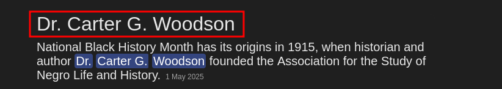

## Step 1: Tracing the Origins of Black History Month
Let’s start with the obvious first question - “Who laid foundation for the Black History Month?”
A quick search brings up Dr. Carter G. Woodson, the historian behind Negro History Week (established in 1926), which eventually became Black History Month. He was all about preserving and highlighting the history of African Americans — definitely the one who laid the foundation.

Dr. Carter G. Woodson is our guy. Now, how do we get his most famous photograph? 

##  Step 2: Finding his most famous photograph
We are asked to take it a step further. So I went to his wikipedia page: https://en.wikipedia.org/wiki/Carter_G._Woodson. We see a lot of information about him like being the founder of the Association for the study of African American Life and History (ASALH) and more. We also see a black-and-white portrait that appears across many biographies, news articles, and educational platforms. This is likely the image referred to in the challenge.

## Step 3: Who was behind the lens?
Clicking on the image redirects us to its wikipedia commons page. I examined the metadata, hoping for a big reveal. What I found instead was… a mystery.
Photographer: _Unknown author_

That’s when the challenge hint started to make sense: “Not everything is meant to be known and may fade away with the sands of time.”
The person behind the photo — possibly one of the most widely shared images of Woodson — is lost to history. We don’t know their name. Just “unknown.”  

Final Answer: _Unknown author_