## About Vulnbank
Vulnbank is an intentionally vulnerable modern banking platform designed for learning cybersecurity, application security testing, and secure coding practices. Built on a Python backend with a PostgreSQL database, the platform exposes a diverse environment spanning traditional web dashboards, hybrid REST/GraphQL APIs, and an LLM-powered AI customer support chatbot. The infrastructure intentionally implements deep security flaws mirroring real-world vulnerabilities across the OWASP Top 10, API Top 10, and LLM Top 10 vectors.
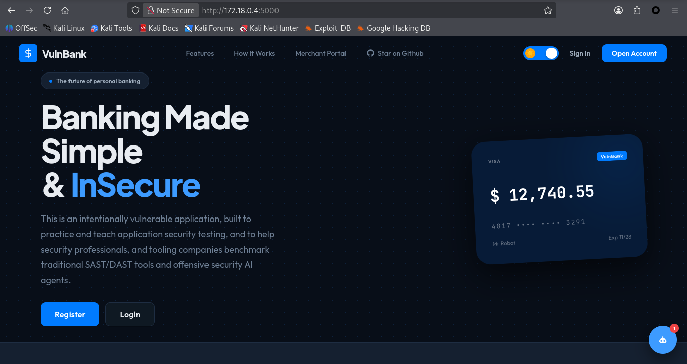

## Registering Users
I started by registering several users and noting down their account numbers. This helped in testing different functionalities in the banking application. 
```plaintext
gracie:grace -> account number: 8457376622
glory:glory -> account number: 5295037256
paul:paul -> account number: 8167652051
```

## Exploiting Vulnerabilities
### Privilege Escalation via Registration/Improper Privilege Management
This occurs when an application automatically maps user-supplied input directly to internal software objects or database models without filtering. The vulnerability steps from a feature in modern web frameworks called Object-Relational Mapping (ORM) auto-binding. <br>
Noticed this from the HTTP response while registering a user. <br>
The HTTP response:
```json
{
  "debug_data": {
    "account_number": "8457376622",
    "balance": 1000.0,
    "fields_registered": [
      "username",
      "password",
      "account_number"
    ],
    "is_admin": false,
    "raw_data": {
      "password": "grace",
      "username": "gracie"
    },
    "registration_time": "2026-07-30 09:06:56.775127",
    "server_info": "Mozilla/5.0 (X11; Linux x86_64; rv:140.0) Gecko/20100101 Firefox/140.0",
    "user_id": 11,
    "username": "gracie"
  },
  "message": "Registration successful! Proceed to login",
  "status": "success"
}
```
The "is_admin" is set to false, meaning the created user is not given admin privileges during registration. We can abuse this during registration and set the 'is_admin' to true while supplying the username and the password. <br>
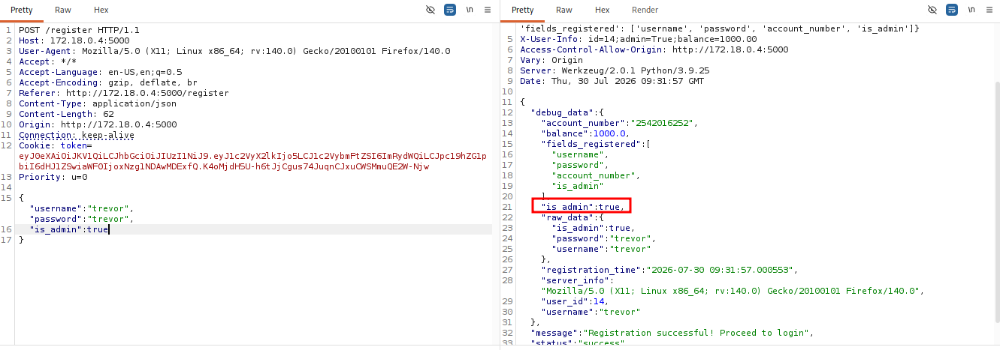
Logging in:
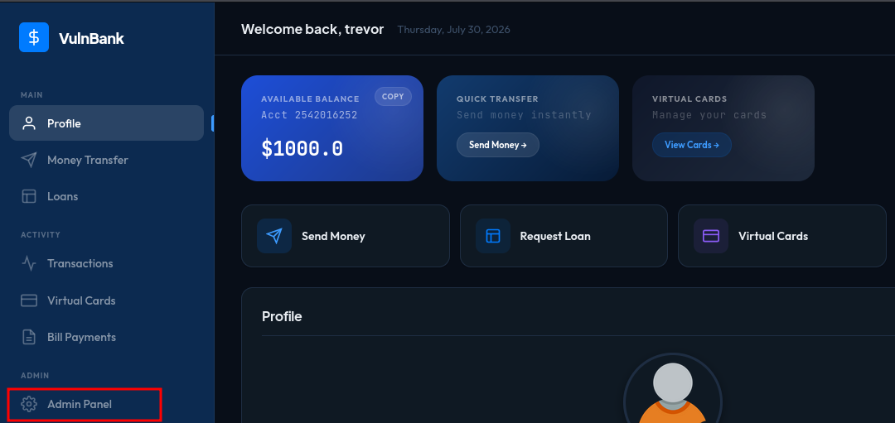
Notice the user has access to the Admin Panel at: http[:]//172[.]18[.]0[.]4[:]5000/sup3r_s3cr3t_admin

#### Impact
An attacker can create an administrator account without authorization. This completely bypasses the application's privilege model and grants unrestricted administrative access. An attacker could manage users, view sensitive information, perform unauthorized transactions, or compromise the entire banking application.

#### Mitigations
 - Never trust client-supplied privilege fields.
 - Ignore security-sensitive attributes such as is_admin during registration.
 - Assign user roles exclusively on the server side.
 - Use allowlists for accepted input fields instead of automatically binding every supplied parameter.
 - Perform authorization checks before granting access to administrative functionality.

### SQL Injection Vulnerability in the Login Form
I intercepted the login request using Burp Suite, then used Burp Intruder and tested for common SQL injection payloads against the username field. <br>
I used SQL injection payloads from this repository: https://github.com/morkev/sql-vulnerabilities
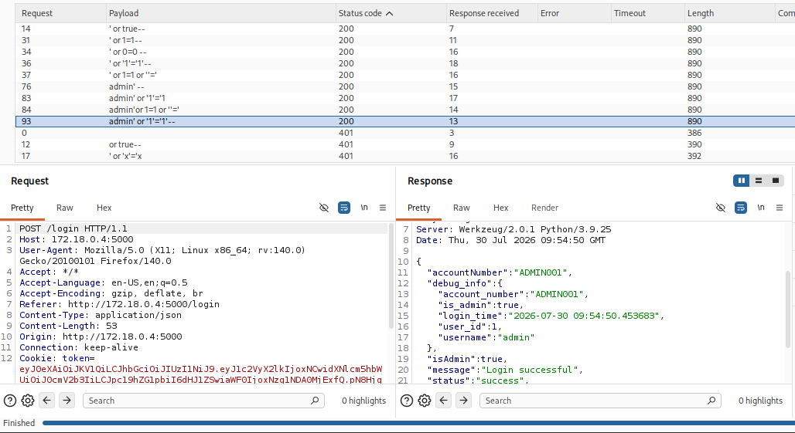
This confirms the login form is vulnerable to SQL injection. <br>
Logging in as the admin: _admin' or '1'='1'--_
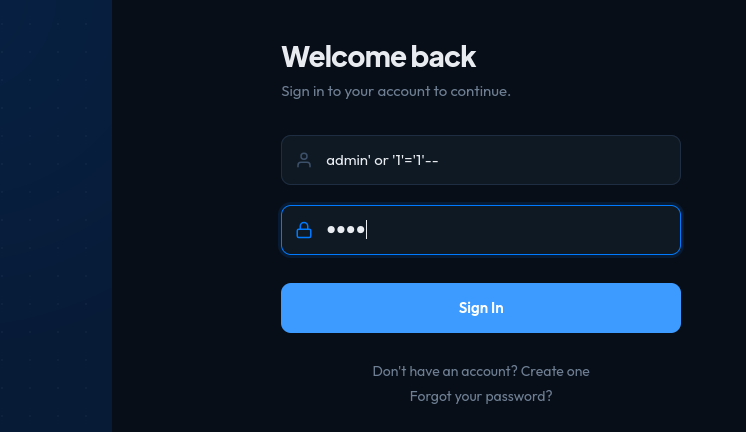
Logged in successfully:
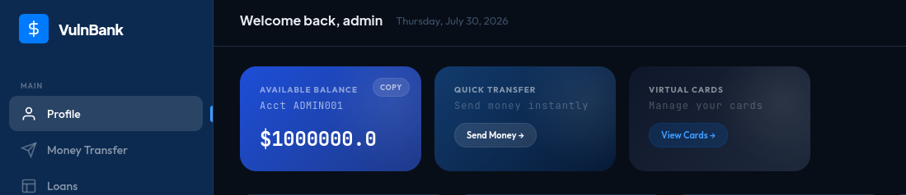

#### Impact
Successful SQL injection allows authentication bypass without valid credentials. Depending on the backend implementation, an attacker may also be able to extract sensitive customer information, modify records, or execute additional database queries.

#### Mitigations
 - Use parameterized queries (prepared statements).
 - Never concatenate user input into SQL queries.
 - Perform server-side input validation.
 - Implement generic authentication error messages.
 - Deploy a Web Application Firewall (WAF) to detect common SQL injection attempts.

### Insecure Direct Object Reference (IDOR)
This is a security flaw that happens when an application gives users direct access to data files or database records based on an ID they provide. It occurs because the web application trusts user input without checking if that specific user actually has permission to view or change the requested resource. <br>
In our case, to view a user’s transaction history, this is the request that you make: _GET /transactions/8457376622_. By changing the account number, I was able to access another user’s transaction history. <br>
Grace’s transaction history:
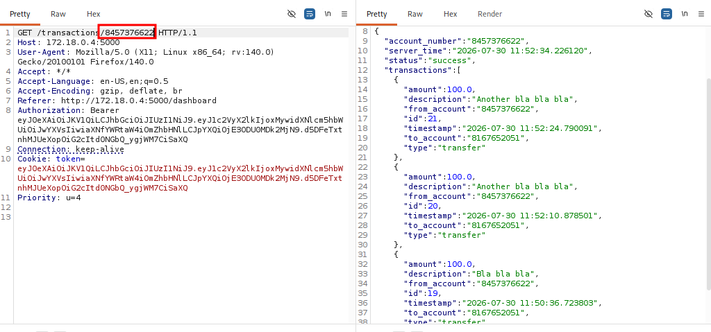
By changing the account number, I was able to read Paul’s transaction history as well:
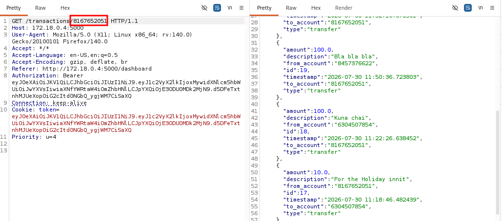

#### Impact
Any authenticated user can access the banking records of other customers simply by modifying account numbers. This results in unauthorized disclosure of sensitive financial information and violates data confidentiality.

#### Mitigations
 - Perform server-side authorization checks on every request.
 - Verify that the authenticated user owns the requested account.
 - Avoid exposing predictable identifiers where possible.
 - Implement object-level authorization controls.

### Business Logic Vulnerability - Negative Transfer Amount
The banking application does not validate that a transfer amount must be a positive number, and a negative input reverses the intended math. <br>
I tested the transfer functionality by submitting a negative transfer amount instead of a positive value. Rather than rejecting the request, the application processed it successfully and reversed the balance calculation, increasing my account balance instead of deducting funds.
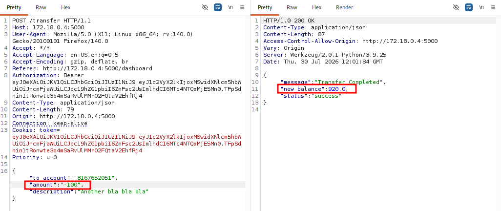

#### Impact
An attacker can artificially increase their account balance or manipulate another user's balance without authorization. This compromises the integrity of financial transactions and could result in financial loss.

#### Mitigations
 - Validate that transfer amounts are greater than zero.
 - Enforce minimum and maximum transaction limits.
 - Perform server-side validation regardless of client-side checks.
 - Reject invalid numerical values before processing business logic.

### SSRF - Server-Side Request Forgery
This is a web security vulnerability that enables an attacker to send requests from a vulnerable server to internal or external systems or the server itself. The vulnerability arises when server functionality can be manipulated to access or modify resources that are otherwise inaccessible. <br>
The 'upload_profile_picture_url' endpoint accepts an arbitrary URL. The server performs requests.get() on the supplied URL. There are no allowlists or scheme restrictions enforced. I tested the endpoint by supplying http[:]//127[.]0[.]0[.]1[:]5000 as the image URL. The server performed the request on my behalf and returned an HTTP 200 response, confirming that arbitrary URLs could be requested from the server.
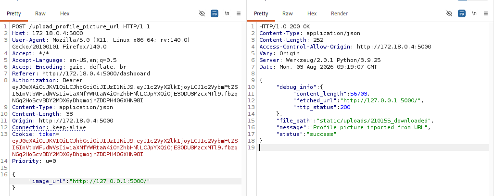

#### Impact
An attacker can force the application server to communicate with internal services that are normally inaccessible. SSRF may be used to scan internal networks, access cloud metadata services, bypass firewalls, or interact with internal administrative interfaces.

#### Mitigations
 - Allow requests only to trusted domains using an allowlist.
 - Block requests to localhost and private IP address ranges.
 - Restrict supported URL schemes.
 - Validate and sanitize user-supplied URLs.
 - Apply network segmentation and outbound firewall rules.

### Stored XSS
This is a web security vulnerability that arises when an application receives data from an untrusted source and includes that data within its later HTTP responses in an unsafe way. <br>
I tested the '/update_bio endpoint' by submitting JavaScript code as my profile bio. The application accepted the input without sanitizing or encoding it and stored it in the database. 
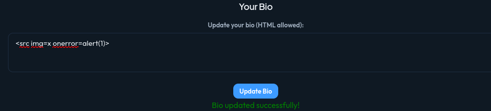

#### Impact
Stored XSS enables attackers to execute arbitrary JavaScript in the browsers of other users. This may lead to session hijacking, credential theft, phishing attacks, or unauthorized actions performed on behalf of victims.

#### Mitigations
 - Encode all user-generated content before rendering it.
 - Sanitize HTML input.
 - Implement a strong Content Security Policy (CSP).
 - Validate and restrict acceptable input formats.
 - Mark authentication cookies as HttpOnly and Secure.

### Business Logic Vulnerability - Improper Loan Validation
I tested the loan request functionality by submitting a negative loan amount. The application accepted and processed the request instead of rejecting the invalid value, indicating that proper server-side validation was missing.
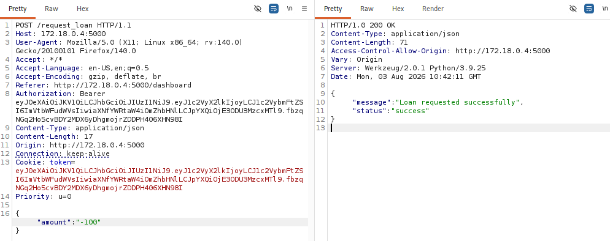

#### Impact
Allowing negative loan values may result in incorrect account balances, inconsistent financial records, or exploitation of the application's business rules. Attackers may manipulate loan calculations to gain financial advantages or corrupt financial data.

#### Mitigations
 - Validate that loan amounts are positive.
 - Define acceptable minimum and maximum loan values.
 - Perform validation on the server before processing requests.
 - Implement business rule validation throughout the loan approval workflow.

### Unrestricted File upload vulnerability
I tested the profile image upload functionality by uploading a file that was not a valid image. The application accepted the upload without validating the file type or content, confirming that file upload restrictions were not enforced.
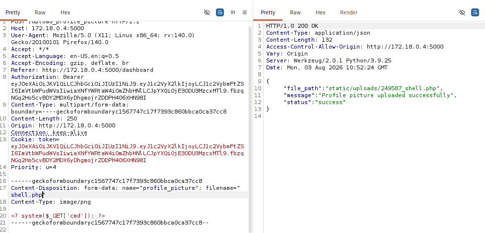

#### Impact
Unrestricted file uploads can allow attackers to upload malicious content. Depending on server configuration, this could result in malware distribution, stored XSS, denial-of-service, or even remote code execution if executable files are processed

#### Mitigations
 - Restrict uploads to approved file types.
 - Validate both MIME types and file signatures (magic bytes).
 - Rename uploaded files using random identifiers.
 - Store uploaded files outside the web root.
 - Scan uploaded files for malicious content.
 - Enforce file size limits and disable execution permissions on upload directories.

## Conclusion
This write-up explores the discovery and exploitation of several vulnerabilities within VulnBank, including authentication, authorization, business logic, input validation, file handling, and information disclosure weaknesses. The findings demonstrate how insecure implementation and excessive exposure of internal application data can provide attackers with valuable information and opportunities to further compromise a web application. <br>

Thank you for reading!😎